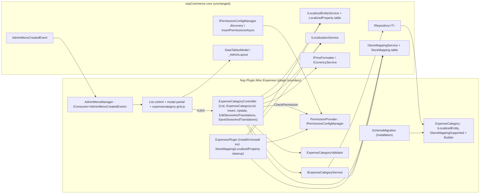

# Technical Design - Expense Category

Source Jira Issue: SCRUM-38 | Target: nopCommerce 4.90.8 (.NET 8) | Area: Admin only
Inputs: `../requirements/clarified-requirement.md` (D1-D4, Q1-Q10), `../stories/user-stories.md` (Stories 1-4), `../acceptance-criteria/acceptance-criteria.md` (AC1.x-AC4.x)
Revision 2: incorporates the stakeholder answers to Q1, Q4, Q6, Q8, Q9, Q10, OQ-A, OQ-B, OQ-C. **Revision 2 changes decision D1 and needs explicit approval, see section 2.**

## 1. Placement Decision (read first)

| Item | Decision |
|---|---|
| **Placement** | **New plugin** (confirmed by the stakeholder, Q10/OQ-C) |
| Plugin | `Nop.Plugin.Misc.Expenses` (folder `src/Plugins/Nop.Plugin.Misc.Expenses`), SystemName `Misc.Expenses`, Group `Misc`, FriendlyName "Expenses", Version `1.0`, SupportedVersions `["4.90"]`, DLL `Nop.Plugin.Misc.Expenses.dll` |
| Plugin interface | `BasePlugin, IMiscPlugin` (same as `TimeLogPlugin`) |
| Core files touched | None. **This is NOT a core modification; no Core Modification Notice is required.** |
| Multi-phase rule | Not applicable (not phase 2+ of time-log). Later Expenses phases extend `Misc.Expenses`. |
| Extension mechanisms used | `IConsumer<AdminMenuCreatedEvent>` (menu), `IPermissionConfigManager` (permission + default role), `INopStartup` (DI), plugin-owned entity + `AutoReversingMigration`, `IStoreMappingSupported` + `IStoreMappingService` (per-store), `ILocalizedEntity` + `ILocalizedEntityService` + `ILocalizedModelFactory` (per-language Name), `BasePluginController` + DataTables admin grid, `ILocalizationService` locale resources |
| Upgrade risk | Low. Only public extension points are used. |

Why a new plugin rather than time-log: time-log's uninstall drops its own tables, roles and `Admin.TimeLog*` locales, so expense data placed there would be destroyed with it; it is at v1.1 with its own migrations, so an unrelated table forces a version bump and update migration; its permissions default to custom roles whereas this feature defaults to Administrators; it owns the separate top-level "Time Log" menu. Conventions (menu consumer, `IPermissionConfigManager`, `INopStartup`, `Create.TableFor<T>()`, DataTables grid, locale seeding/removal, sibling Tests project) are copied as patterns, not shared code.

## 2. D1 Reconciliation - APPROVAL REQUIRED

### 2.1 The conflict
D1 says create and edit both happen inline in the grid, with no separate create/edit pages. The stakeholder has since decided:
- Q8: categories are per store (store mapping). Choosing stores needs a multi-select, which does not fit a grid cell.
- Q9: Name is localizable per language. Per-language Name editors (one per installed language) do not fit a grid cell.

Both cannot be satisfied by inline cell editing alone.

### 2.2 Proposed reconciliation
Keep D1's spirit (no navigation to a separate create/edit page, everything done on the one grid page) and add one dialog:

| Concern | Original D1 | Proposed |
|---|---|---|
| Create | Inline in grid | **Unchanged in spirit.** "Add new" panel above the grid (time-log pattern, OQ-A accepted): Name (default language), Per Month Limit, Type. |
| Edit Name (default language) and Per Month Limit | Inline in grid | **Unchanged.** DataTables inline edit (Edit/Confirm/Cancel), Type read-only (D3). |
| Edit stores | n/a (was shared) | **New: per-row "Edit stores and translations" button opens a modal dialog on the same page.** Multi-select of stores. |
| Edit per-language Name | n/a (was single) | **New: same modal.** One Name field per non-default language (and shown for default as read-only reference). |
| New category defaults | n/a | Created with `LimitedToStores = false` (available in all stores) and no translations. Stores/translations are set afterwards through the modal. |

### 2.3 What changes against D1 (for the user to approve)
1. **D1 is relaxed from "inline-only" to "inline for Name (default language), Per Month Limit; modal dialog for stores and translations".** There is still no separate create page or edit page and no navigation away from the grid page.
2. The Add panel cannot set stores or translations at creation time; this is a second step via the modal. (Alternative if unacceptable: put a store multi-select and language tabs in the Add panel, which makes the panel heavy; not recommended.)
3. A new endpoint pair and a partial view are added (section 5), plus new acceptance criteria (section 8.2).
4. Name has two representations: the stored value on the entity (the default-language Name, edited inline) and optional per-language values in `LocalizedProperty` (edited in the modal). A translation left empty falls back to the default value.

If the user rejects the modal, the only inline-only options are dropping Q8 and Q9 or accepting a store/translation editor on a separate page; both contradict an explicit answer, so the modal is the recommendation.

### 2.4 Other accepted points
- OQ-A: Add panel above grid (time-log pattern) accepted. OQ-B: the grid is the framework's DataTables, not Kendo; there is no Kendo in this repo's 4.90 admin (time-log's `Content/timelog-grid.js` documents the same). Both accepted.
- Some time-log comments say "5.00", but `Nop.Web.csproj` is `<Version>4.90</Version>` and `AdminMenuCreatedEvent` exists in `Nop.Web.Framework/Events`, so the menu-event approach is valid for 4.90.x. Developer to confirm on first build.
- The requirement set contains no "enabled/active" field for categories, so none is designed. Add only if the stakeholder asks.

## 3. Step 2 - Entity & Data Design

### 3.1 Entity `ExpenseCategory` (`Domain/ExpenseCategory.cs`, namespace `Nop.Plugin.Misc.Expenses.Domain`)
`public class ExpenseCategory : BaseEntity, ILocalizedEntity, IStoreMappingSupported`

| Property | Type | DB column | Rule | Trace |
|---|---|---|---|---|
| `Id` | int (BaseEntity) | PK identity | - | - |
| `Name` | string | `nvarchar(200)` NOT NULL | Required, max 200, **duplicates allowed** (Q6). This is the default-language value; other languages live in `LocalizedProperty`. | Jira line 3, AC3.1, AC4.11 |
| `PerMonthLimit` | decimal? | `decimal(18,4)` NULL | Optional; null = no limit; >= 0; applies to **both** Expense and Income (Q4); informational only | D2, AC3.4, AC4.6-4.8, AC4.10, AC4.12 |
| `ExpenseCategoryTypeId` | int | `int` NOT NULL | Backing for enum; required; immutable after insert | D3, AC4.3-4.5 |
| `ExpenseCategoryType` | `[NotMapped]` enum property | - | Same pattern as `Project.Status`/`StatusId` in time-log | D3 |
| `LimitedToStores` | bool | `bit` NOT NULL default 0 | `IStoreMappingSupported`. False = all stores; true = only stores with a `StoreMapping` row | Q8, AC4.13 |
| `CreatedOnUtc` | DateTime | `datetime2` NOT NULL | Set on insert | audit |
| `UpdatedOnUtc` | DateTime | `datetime2` NOT NULL | Set on insert/update | audit |

Enum `ExpenseCategoryType` (`Domain/ExpenseCategoryType.cs`): `Expense = 1`, `Income = 2`. Starts at 1 so an unset `0` fails validation (AC4.3). Display via `GetLocalizedEnumAsync`, keys `Enums.Nop.Plugin.Misc.Expenses.Domain.ExpenseCategoryType.Expense|Income`.

No `Deleted` column (no delete, Q1). Money is stored as entered in the primary currency (D2); no per-category currency, no conversion.

### 3.2 Related framework tables (no schema owned by the plugin)
- **`StoreMapping`** (core table): rows with `EntityName = "ExpenseCategory"` (the entity CLR type name, `nameof(ExpenseCategory)`), `EntityId`, `StoreId`. Written via `IStoreMappingService.SaveStoreMappingsAsync(category, selectedStoreIds)` (same call time-log's `ProjectController` uses), which also keeps `LimitedToStores` in step and invalidates its own cache.
- **`LocalizedProperty`** (core table): rows with `LocaleKeyGroup = "ExpenseCategory"`, `LocaleKey = "Name"`, `EntityId`, `LanguageId`, `LocaleValue`. Written via `ILocalizedEntityService.SaveLocalizedValueAsync(category, c => c.Name, value, languageId)` (the pattern core `ManufacturerController.UpdateLocalesAsync` uses); the framework invalidates its localized-property cache.
- No new migration is needed for these two tables. Both are core tables that already exist.

### 3.3 Migration
- `Data/Migrations/SchemaMigration.cs`: `[NopMigration("2026/10/04 00:00:00", "Nop.Plugin.Misc.Expenses schema", MigrationProcessType.Installation)] public class SchemaMigration : AutoReversingMigration`, `Up()` = `Create.TableFor<ExpenseCategory>()` (this version includes the `LimitedToStores` column from the start, so no separate Update migration). `Down()` is auto-reversed by the framework after `UninstallAsync`. Timestamp literal must be unique and never changed after release.
- `Data/Mapping/Builders/ExpenseCategoryBuilder.cs` (`NopEntityBuilder<ExpenseCategory>`): `Name` `AsString(200).NotNullable()`, `PerMonthLimit` `AsDecimal(18, 4).Nullable()`, `ExpenseCategoryTypeId` `AsInt32().NotNullable()`, `LimitedToStores` `AsBoolean().NotNullable().WithDefaultValue(false)`.
- Table naming: database standard 3 asks for distinct plugin table names. Recommended: `INameCompatibility` mapping `ExpenseCategory` to `Expenses_ExpenseCategory` (developer to confirm the mechanism in 4.90.8; fall back to `ExpenseCategory`, which does not collide with any core table). `StoreMapping.EntityName` and `LocalizedProperty.LocaleKeyGroup` use the CLR type name and are unaffected by the table name.
- **No unique index and no uniqueness rule on Name (Q6: duplicates allowed).** An index on `Name` for the search filter is not needed for v1.0 volumes; add in an Update migration only if the table grows large.
- No seed data.

### 3.4 Uninstall data cleanup (new, caused by Q8/Q9)
Dropping the `ExpenseCategory` table does not remove `StoreMapping` and `LocalizedProperty` rows, which are core tables. For `Install`/`Uninstall` symmetry, `UninstallAsync` must delete, **before** `base.UninstallAsync()`, all `StoreMapping` rows with `EntityName == nameof(ExpenseCategory)` and all `LocalizedProperty` rows with `LocaleKeyGroup == nameof(ExpenseCategory)` (via `IRepository<StoreMapping>` / `IRepository<LocalizedProperty>` predicate delete, or a service wrapper). Without this, orphan rows persist and could attach to a future entity reusing the same ids and name.

### 3.5 Settings, ACL
No `ISettings` class. No customer-role ACL on the entity; access control is the single permission (5.4).

## 4. Step 3 - Service & Extension Point Design

### 4.1 Services (`Infrastructure/NopStartup.cs`, `INopStartup`: `services.AddScoped<IExpenseCategoryService, ExpenseCategoryService>()`, `Order => 3000`)
`Services/IExpenseCategoryService.cs`, all async, `IRepository<ExpenseCategory>`-backed, with `IRepository<StoreMapping>` injected (store filter, BUG-010):
- `Task<IPagedList<ExpenseCategory>> GetAllExpenseCategoriesAsync(string name = null, int storeId = 0, int pageIndex = 0, int pageSize = int.MaxValue)`
  - `name`: when non-empty, trimmed, case-insensitive "contains" on the stored `Name` column (Q1 search). Parameterized LINQ, no concatenated SQL.
  - `storeId`: when `> 0`, applies the service's own store-mapping filter (not the stock `IStoreMappingService.ApplyStoreMapping`, which returns the query unfiltered when `CatalogSettings.IgnoreStoreLimitations` is on or when no StoreMapping rows exist; decision on BUG-010: the filter must work regardless of that setting, which the service never reads): a single parameterized sub-select of `StoreMapping.EntityId` where `EntityName = "ExpenseCategory"` and `StoreId = storeId`, applied as `!LimitedToStores || mappedIds.Contains(Id)`, so it returns categories available in that store (unlimited ones plus mapped ones), in one query with no N+1. When `0`, no store filter, so the admin sees every category.
  - Order by `Name`, then `Id`. `pageSize` clamped to `NopExpensesDefaults.MaxPageSize` (100), AC3.2.
- `Task<ExpenseCategory> GetExpenseCategoryByIdAsync(int id)`
- `Task InsertExpenseCategoryAsync(ExpenseCategory category)` (sets timestamps)
- `Task UpdateExpenseCategoryAsync(ExpenseCategory category)` (sets `UpdatedOnUtc`)
- Not included: Delete (Q1), `IsNameInUseAsync` (Q6).

Single validator `Validators/ExpenseCategoryValidator : BaseNopValidator<ExpenseCategory>` (auto-registered by assembly scan; do NOT register again). Rules:
- Type must be a defined enum value: `...Validation.TypeRequired` (AC4.3).
- `PerMonthLimit` when not null `>= 0`: `...Validation.PerMonthLimitInvalid` (AC4.7, AC4.8). Same rule for Income and Expense (Q4).
- `Name` required, max 200: `...Validation.NameRequired`, `...Validation.NameTooLong` (AC4.11). No uniqueness rule.
- Translation values (modal): when non-empty, max 200, validated in the controller with the same `NameTooLong` message (empty allowed, falls back to default).

Insert and update both run the validator; the modal save re-validates translation lengths and the store ids (AC4.9).

### 4.2 Localized Name read path
Wherever a name is shown for a language, use `ILocalizationService.GetLocalizedAsync(category, c => c.Name)` (falls back to the stored Name when no translation exists). The admin grid shows and inline-edits the **stored (default-language) value**, consistent with core admin grids; localized display is for any future consumer (a later expense-entry phase) and for the modal's reference.

### 4.3 Events
No custom domain events. The framework raises `EntityInsertedEvent<ExpenseCategory>`/`EntityUpdatedEvent<ExpenseCategory>` automatically. The only `IConsumer` is `AdminMenuCreatedEvent` (5.1).

### 4.4 Caching and cache keys
- The plugin still adds no `IStaticCacheManager` reads: admin-only paged data, filtered by an arbitrary name and store, is not worth caching and nothing else consumes it yet.
- `NopExpensesDefaults` reserves prefix `Nop.plugins.misc.expenses.expensecategory.` (`ExpenseCategoriesPatternCacheKey`); `Insert`/`Update`/modal-save call `RemoveByPrefixAsync` on it so any future cached reader is invalidated at the right points.
- Framework caches touched, all invalidated by the framework when the documented service methods are used (do NOT write rows directly through the repository, or the cache goes stale): store mappings (`SaveStoreMappingsAsync`) and localized properties (`SaveLocalizedValueAsync`). This is why the modal save must go through those services.

### 4.5 Widget zones / provider interfaces
None (no storefront component).

### 4.6 Controller (`Controllers/ExpenseCategoryController : BasePluginController`)
Class attributes `[Area(AreaNames.ADMIN)] [AuthorizeAdmin] [AutoValidateAntiforgeryToken]`; every action `[CheckPermission(PermissionProvider.ManageExpenseCategories)]` (AC2.3). Dependencies: services, validator, localization, `ILocalizedEntityService`, `ILocalizedModelFactory`, `IStoreMappingService`, `IStoreMappingSupportedModelFactory`, `IPriceFormatter`, `ICurrencyService`, `CurrencySettings`. No repository access in the controller.

| Action | Verb | Purpose | Trace |
|---|---|---|---|
| `List()` | GET | Returns `~/Plugins/Misc.Expenses/Views/ExpenseCategory/List.cshtml` with the search model (`SetGridPageSize()`), populates the store filter dropdown | AC1.2, AC3.3, AC3.6 |
| `ExpenseCategoryList(searchModel)` | POST | Paged JSON read with `SearchName` and `SearchStoreId`; `pageSize = Math.Min(searchModel.PageSize, 100)`; `PrepareToGridAsync` | AC3.1-3.6 |
| `ExpenseCategoryInsert(model)` | POST | `ModelState` check, build entity (`LimitedToStores = false`), validate, insert; failures return `Json(new { fieldErrors })` | AC4.1, 4.3, 4.6-4.9 |
| `ExpenseCategoryUpdate(model)` | POST | Load by id (not found -> localized `ErrorJson`), apply Name and PerMonthLimit only, type lock, validate, update | AC4.2, 4.4, 4.5, 4.8, 4.9 |
| `EditStoresAndTranslations(id)` | GET | Returns a partial view (modal body): store multi-select (`IStoreMappingSupportedModelFactory.PrepareModelStoresAsync`) plus per-language Name fields (`ILocalizedModelFactory.PrepareLocalizedModelsAsync` with `GetLocalizedAsync`) | AC4.13, AC4.14 |
| `SaveStoresAndTranslations(model)` | POST | Load by id, validate translation lengths, `SaveStoreMappingsAsync(category, SelectedStoreIds)` (also sets `LimitedToStores`), then for each `Locales` entry `SaveLocalizedValueAsync(category, c => c.Name, value, languageId)`; update `UpdatedOnUtc`; JSON result | AC4.13, AC4.14 |

Type lock (D3, AC4.5) in `ExpenseCategoryUpdate`: the stored `ExpenseCategoryTypeId` is never assigned from the model. A posted type that differs from the stored value is rejected with `ErrorJson(...Validation.TypeLocked)` and nothing is saved; an equal value (stock inline edit posts every column) proceeds. `SaveStoresAndTranslations` never touches Name (stored), limit or type.

Binding errors: `PerMonthLimit` is bound as `decimal?`; a non-numeric value yields a `ModelState` error, which insert/update map to the same localized `PerMonthLimitInvalid` field error as the validator (AC4.8, AC4.9).

Models (`Models/Admin/`, `record` types):
- `ExpenseCategorySearchModel : BaseSearchModel` with `SearchName` (string) and `SearchStoreId` (int, 0 = all) plus `AvailableStores` select list.
- `ExpenseCategoryListModel : BasePagedListModel<ExpenseCategoryModel>`.
- `ExpenseCategoryModel : BaseNopEntityModel` with `Name`, `PerMonthLimit` (decimal?, raw for edit), `PerMonthLimitDisplay` (primary-currency formatted, empty when null), `ExpenseCategoryTypeId`, `ExpenseCategoryTypeName`, `LimitedToStores` (display flag), `[NopResourceDisplayName]` on all.
- `ExpenseCategoryStoresAndTranslationsModel : BaseNopEntityModel, IStoreMappingSupportedModel, ILocalizedModel<ExpenseCategoryLocalizedModel>` with `Name` (read-only reference), `SelectedStoreIds`, `AvailableStores`, `Locales`.
- `ExpenseCategoryLocalizedModel : ILocalizedLocaleModel` with `LanguageId`, `Name`.

Currency display: `IPriceFormatter.FormatPriceAsync(limit, showCurrency: true, primaryStoreCurrency)`; primary currency via `ICurrencyService.GetCurrencyByIdAsync(CurrencySettings.PrimaryStoreCurrencyId)`, resolved once per request (no N+1). No conversion (stored in primary).

## 5. Step 4 - Admin UI Design

### 5.1 Menu
`Infrastructure/AdminMenuManager : IConsumer<AdminMenuCreatedEvent>` as in time-log. Guard: `LoadPluginBySystemNameAsync("Misc.Expenses")` null -> return (menu disappears on uninstall, AC2.5). Top-level "Expenses" (SystemName `Nop.Plugin.Misc.Expenses.ExpensesAdminMenu`, `IconClass` e.g. `fas fa-wallet`) with exactly one child "Expense Category" (SystemName `Nop.Plugin.Misc.Expenses.ExpenseCategoryAdminMenu`, `Url = eventMessage.GetMenuItemUrl("ExpenseCategory", "List")`). `PermissionNames = { ManageExpenseCategories }` on both the child and the top-level item (AC1.1, AC2.2). Inserted via `RootMenuItem.InsertBefore("Third party plugins", section)` with `ChildNodes.Add` fallback. Titles from locale resources (AC1.3). The view calls `NopHtml.SetActiveMenuItemSystemName(...)`.

### 5.2 Page `Views/ExpenseCategory/List.cshtml` (+ `Views/_ViewImports.cshtml`)
`Layout = "_AdminLayout"`. Top to bottom:
1. **Search panel** (standard collapsible `search-row` with a `data-hideAttribute`, as in time-log's views): Name text box (`SearchName`), Store dropdown (`SearchStoreId`, default "All stores"), Search button (AC3.6).
2. **"Add new" panel**: Name, Per Month Limit, Type dropdown (Expense/Income, required marker), Save, per-field error containers. Creates with all-stores default (2.2).
3. **Grid** (`DataTablesModel`, Name `expensecategory-grid`): `UrlRead` -> `ExpenseCategoryList` (sends the search fields), `UrlUpdate` -> `ExpenseCategoryUpdate`, **no `UrlDelete`**, server-side paging, `LengthMenu` capped at 100. Columns: Name (editable, stored value), Per Month Limit (editable, renders `PerMonthLimitDisplay`), Type (localized text, **not** `Editable`, AC4.4), Stores (display: "All stores" when `LimitedToStores` is false, else "Limited"), and a per-row button column holding the stock Edit/Confirm/Cancel plus an **"Edit stores and translations"** button.
4. **Modal** (`#expensecategory-stores-translations-modal`, Bootstrap modal, content loaded by AJAX from `EditStoresAndTranslations`): store multi-select (same select2 usage as time-log's `Project/_CreateOrUpdate.cshtml`), per-language Name fields (admin localized-editor pattern), Save and Cancel; on save posts to `SaveStoresAndTranslations`, closes, and reloads the grid. Developer to verify the localized-editor tag helper works inside an AJAX-loaded partial; fallback is the admin popup window pattern (`_AdminPopupLayout`), which is still same-page-flow from the user's view.

`Content/expensecategory-grid.js`: Add panel submit, modal open/save, `fieldErrors` display, grid reload, passes the antiforgery token. No business logic in views or script.

Accessibility (WCAG 2.1 AA): every input has a real label; errors use `role="alert"`/`aria-live="polite"` and `aria-describedby`; the modal traps focus, closes on Escape, returns focus to the triggering button, and has `aria-labelledby` pointing at its title; icon-only buttons have accessible names from locale; the Type select and all grid actions are keyboard operable (developer verifies the stock edit/confirm/cancel icons are reachable and adds `aria-label`s if not).

### 5.3 Configuration page
None.

### 5.4 Permission
`Infrastructure/PermissionProvider : IPermissionConfigManager` (public parameterless ctor, discovered by `ITypeFinder`, not registered in DI):
- `ManageExpenseCategories = "Misc.Expenses.ManageExpenseCategories"`, `Category = "Misc.Expenses"`.
- `AllConfigs`: `new PermissionConfig("Admin area. Manage expense categories", ManageExpenseCategories, Category, NopCustomerDefaults.AdministratorsRoleName)`. Record and Administrators mapping are inserted by the framework on the next application start.
- One permission covers the menu, grid read, insert, update, search and the modal endpoints (AC2.4). No role creation or role cleanup is needed (core role).

### 5.5 Plugin lifecycle (`ExpensesPlugin : BasePlugin, IMiscPlugin`)
- `InstallAsync`: `AddOrUpdateLocaleResourceAsync(GetLocaleResources())`, `base.InstallAsync()`. Schema migration runs before it; the permission record is created by the framework on restart.
- `UninstallAsync` (symmetric): `DeletePermissionAsync(ManageExpenseCategories)`; delete the plugin's `StoreMapping` and `LocalizedProperty` rows (3.4); `DeleteLocaleResourcesAsync("Admin.Expenses")`; `DeleteLocaleResourcesAsync("Enums.Nop.Plugin.Misc.Expenses.Domain.ExpenseCategoryType")`; `DeleteLocaleResourceAsync($"Security.Permission.{ManageExpenseCategories}")`; `base.UninstallAsync()`. Table dropped by the auto-reversed migration; menu vanishes via the plugin-installed guard (AC2.5). No settings, tasks or roles to remove.

### 5.6 Localization inventory (key prefix `Admin.Expenses`; proposed English text, developer may refine wording within this key set)
- Menu: `Admin.Expenses.Menu.Expenses` "Expenses"; `Admin.Expenses.Menu.ExpenseCategory` "Expense Category".
- Page/grid: `...ExpenseCategory.PageTitle` "Expense categories"; `...List.AddNew` "Add new"; `...List.Name` "Name"; `...List.PerMonthLimit` "Per month limit"; `...List.Type` "Expense or income"; `...List.Stores` "Stores"; `...List.Stores.All` "All stores"; `...List.Stores.Limited` "Limited to selected stores"; `...List.EditStoresAndTranslations` "Edit stores and translations".
- Search: `...Search.Name` "Name"; `...Search.Store` "Store"; `...Search.Store.All` "All stores".
- Fields (model display names): `...Fields.Name`, `...Fields.PerMonthLimit`, `...Fields.Type`, `...Fields.Type.Select` "Select a type", `...Fields.LimitedToStores`, `...Fields.SelectedStoreIds` "Limited to stores", `...Fields.Locales.Name` "Name (translation)".
- Modal: `...StoresAndTranslations.Title` "Stores and translations"; `...StoresAndTranslations.Save`; `...StoresAndTranslations.Cancel`; `...StoresAndTranslations.DefaultNameHint` "Edit the default name inline in the grid. Leave a translation empty to use the default name.".
- Enum: `Enums.Nop.Plugin.Misc.Expenses.Domain.ExpenseCategoryType.Expense` "Expense"; `...Income` "Income".
- Validation: `...Validation.NameRequired`, `...Validation.NameTooLong`, `...Validation.TypeRequired`, `...Validation.TypeLocked`, `...Validation.PerMonthLimitInvalid`, `...Validation.RecordNotFound`. (No `NameDuplicate`, per Q6.)
- Notifications: `...Added`; `...Updated`; `...StoresAndTranslations.Saved`.
- Accessibility labels: `...Accessibility.EditRow`, `...Accessibility.SaveRow`, `...Accessibility.CancelEdit`, `...Accessibility.CloseDialog`.
- Permission: `Security.Permission.Misc.Expenses.ManageExpenseCategories` "Admin area. Manage expense categories".
Language-specific translations of these admin strings are out of scope; the resources ship in the default language like other plugins' (the admin locale can be extended through standard locale import).

## 6. Step 5 - Architecture Diagram

Flows: menu -> `List` -> view -> DataTables POST `ExpenseCategoryList` (name/store filter) -> service -> repository. Inline write: Add panel / confirm -> Insert|Update -> `ModelState` -> validator -> service. Modal write: button -> `EditStoresAndTranslations` partial -> `SaveStoresAndTranslations` -> `IStoreMappingService` and `ILocalizedEntityService`.

## 7. Project Files / Structure (for the planner)
`src/Plugins/Nop.Plugin.Misc.Expenses/`: `plugin.json` (all fields: Group, FriendlyName, SystemName, Version, SupportedVersions, Author "OfficeManagement Team", DisplayOrder, FileName, Description), `Nop.Plugin.Misc.Expenses.csproj` (copy of time-log's; `OutputPath` -> `Plugins\Misc.Expenses`; plugin.json/views/js as `Content` `PreserveNewest`), `ExpensesPlugin.cs`, `NopExpensesDefaults.cs`, `Domain/`, `Data/Migrations/`, `Data/Mapping/Builders/`, `Services/`, `Validators/`, `Models/Admin/`, `Controllers/`, `Infrastructure/` (`AdminMenuManager`, `NopStartup`, `PermissionProvider`), `Views/_ViewImports.cshtml`, `Views/ExpenseCategory/List.cshtml`, `Views/ExpenseCategory/_EditStoresAndTranslations.cshtml`, `Content/expensecategory-grid.js`. Add to `src/NopCommerce.sln`.
Tests: sibling `src/Plugins/Nop.Plugin.Misc.Expenses.Tests` (xUnit, mirrors `Nop.Plugin.Misc.TimeLog.Tests`): validator (name required/max 200, duplicates accepted, type, limit incl. Income), service (paging clamp, ordering, name filter case-insensitive and trimmed, store filter via mocked `IStoreMappingService`, timestamps), controller (type-lock rejection, `ModelState` limit mapping, permission attribute on all six actions, modal save calls `SaveStoreMappingsAsync` and `SaveLocalizedValueAsync` and does not alter type), plugin lifecycle symmetry including StoreMapping/LocalizedProperty cleanup.

## 8. Traceability

### 8.1 Design to existing criteria
| Design element | Requirement / Story / AC |
|---|---|
| New plugin, menu consumer (5.1) | Jira line 1; Story 1; AC1.1-1.3 |
| `PermissionProvider`, `[CheckPermission]` on all actions, lifecycle cleanup (4.6, 5.4, 5.5) | Jira line 2, D4; Story 2; AC2.1-2.5 |
| Entity, list action, grid columns, currency display, paging clamp (3.1, 4.6, 5.2) | Jira line 3; Story 3; AC3.1-3.5 |
| Name search filter and store filter (4.1, 4.6, 5.2) | Q1 answer; AC3.6 |
| Insert/Update, Add panel, inline edit (4.6, 5.2) | D1 (as revised, section 2); Story 4; AC4.1, AC4.2 |
| Type enum, read-only column, server lock (3.1, 4.6, 5.2) | D3; AC4.3-AC4.5 |
| `PerMonthLimit` nullable decimal, both types, validator, no enforcement (3.1, 4.1) | D2, Q4; AC4.6-AC4.10, AC4.12, AC3.4 |
| Name required, max 200, duplicates allowed (3.1, 4.1) | Q6; AC4.11 |
| `IStoreMappingSupported`, `StoreMapping`, modal store picker (3.1, 3.2, 4.6, 5.2) | Q8; AC4.13 |
| `ILocalizedEntity`, `LocalizedProperty`, modal translations (3.1, 3.2, 4.2, 4.6, 5.2) | Q9; AC4.14 |
| Shared validator for UI and direct calls (4.1) | AC4.9 |
| Locale inventory (5.6) | AC1.3, AC4.3, AC4.8 |

### 8.2 Acceptance criteria that need the BA to add or rewrite (not done by the designer)
- AC3.6: search by Name (trimmed, case-insensitive contains) and Store filter; no delete.
- AC4.11: Name required, max 200, duplicates allowed.
- AC4.12: Per Month Limit applies to both types (closed).
- AC4.13: a stores dialog per row; new categories default to all stores; a category limited to stores is returned by the store filter only for those stores; permission-gated server-side.
- AC4.14: a translations dialog per row; an empty translation falls back to the default Name; translations over 200 characters are rejected.
- New: AC for the modal itself (opens from the row, keyboard accessible, saving updates the grid, no page navigation) and for uninstall removing StoreMapping/LocalizedProperty rows.
- D1 text in `clarified-requirement.md` should be updated once the user approves section 2.

## 9. Open Design Questions
None. All questions are resolved.

### Resolved Decisions
Q1, Q4, Q6, Q8, Q9, Q10, OQ-A, OQ-B and OQ-C were resolved earlier and are designed in (sections 1-5). The four decisions raised by revision 2 are now also resolved by the user (the BA docs record them as D1, D11, D12 and AC4.13):
- **DR-1 (approved): D1 relaxation.** Inline editing for default-language Name and Per Month Limit, plus a per-row "Edit stores and translations" modal on the same page (section 2).
- **DR-2 (approved): Name search** matches the stored (default-language) Name only.
- **DR-3 (approved): Grid scope.** The grid lists all categories regardless of store, with an optional Store filter (default "All stores").
- **DR-4 (approved): New category defaults.** Created for all stores with no translations; stores and translations are set later via the modal (section 2.2).
