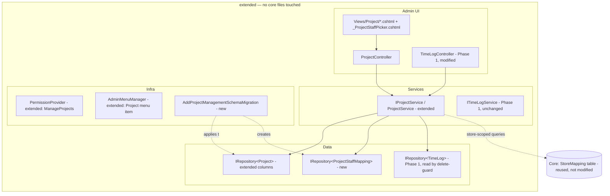

# Technical Design — Time Log Module, Phase 2 (Project Management)

**Traces to:** `docs/time-log/requirements/phase2-project-management.md`, `docs/time-log/stories/phase2-project-management.md`, `docs/time-log/acceptance-criteria/phase2-project-management.md`
**Target nopCommerce version:** 4.90.8 line — **but this repo's actual `Nop.Plugin.Misc.TimeLog` source targets `net9.0` / nopCommerce 5.00 APIs** (confirmed: `TimeLogPlugin.cs` remarks, `.csproj` TargetFramework, `IPermissionConfigManager`, `IConsumer<AdminMenuCreatedEvent>`). This design follows the **actual 5.00 patterns found in the repo**, not generic 4.90.8 assumptions — see Critical Finding #1 below.

---

## CRITICAL FINDING — Reconcile Before Implementation Planning Proceeds

The BA requirement doc (§2.3, §4, Decision 6) states: *"No existing project/HR plugin to extend... build new `Project`/`ProjectStaffMapping` entities in the existing Time Log plugin."*

**This is factually incorrect against the current repo.** A `Project` entity, `IProjectService`/`ProjectService`, and a matching `ProjectBuilder`/migration **already exist** in `Nop.Plugin.Misc.TimeLog` from Phase 1:

- `Domain/Project.cs` — `Id`, `Name`, `Active` (bool) only.
- `Services/IProjectService.cs` / `ProjectService.cs` — `GetProjectByIdAsync`, `GetAllActiveProjectsAsync` (cached via `NopTimeLogDefaults.ActiveProjectsCacheKey`/`ProjectsPatternCacheKey`), `GetAllProjectsAsync` (paged, explicitly commented `// reserved for future admin CRUD`), `InsertProjectAsync`, `UpdateProjectAsync`. **No `DeleteProjectAsync` exists yet.**
- `Data/Migrations/SchemaMigration.cs` already creates the `Project` table (`Create.TableFor<Project>()`).
- `TimeLogPlugin.InstallAsync` already seeds 3 default `Active` projects.
- A **"Manager" `CustomerRole`** (`TimeLogManager` system name) and **`ManageTimeLogAll`** permission already exist — but these govern *viewing all staff' time logs* (`TimeLogAdminController`), a different concern from the new project-CRUD/staff-assignment feature. They must **not** be reused or renamed for Phase 2 — a distinct "Project Manager" role/`ManageProjects` permission is required, exactly as the BA doc specifies, to keep the two concerns independent per Decision 6/§2.1.

**Design decision (this document proceeds on this basis):** Phase 2 **extends the existing `Project` entity** (adds `StartDate`, `EndDate`, `Description`, `StatusId`, `CreatedOnUtc`, `UpdatedOnUtc`, retains `Active` for backward read-compatibility — see §2 migration notes) rather than creating a duplicate entity, and **adds the new `ProjectStaffMapping` entity**. This is still fully consistent with the BA's Decision 6 intent ("no separate project/HR plugin — stays inside Time Log plugin") — the only correction is that the entity is *extended*, not created from scratch, and `IProjectService`/`ProjectService` are extended rather than replaced.

**Action required before `nopcommerce-implementation-planner` scopes tasks:** confirm with the requirement owner that extending the existing `Project` entity (vs. two parallel Project concepts) is acceptable, and that the existing `Active` bool is superseded by the new `Status` enum for eligibility purposes (see §2.1) rather than kept as an independent flag. Flagged per CLAUDE.md "do not assume undocumented business rules" — do not start development until this is acknowledged.

---

## Step 1 — Placement Decision

| Placement | Selected? | Justification |
|---|---|---|
| New plugin | No | Feature is a natural extension of an existing, actively-maintained plugin (`Nop.Plugin.Misc.TimeLog`) that already owns the `Project` concept. |
| Extension of existing plugin | **YES** | `Project`/`ProjectStaffMapping` entities, services, controller, views, migration, permissions, and admin menu item all live inside `Nop.Plugin.Misc.TimeLog`. No core files are touched. |
| Plugin-based override of core behavior | No | Not applicable — nothing in core nopCommerce behavior is being overridden; this is net-new plugin-internal functionality plus a query-source change inside the plugin's own controller. |
| Genuine core modification | No | Not needed. No core file is touched anywhere in this design. |

**Verified against repo structure**, not assumed (per task instruction): confirmed via direct inspection of `src/Plugins/Nop.Plugin.Misc.TimeLog/*` (existing `Project`/`IProjectService`, `PermissionProvider`, `AdminMenuManager`, `SchemaMigration`, `TimeLogController`, `TimeLogSearchModel`) — all Phase 2 work attaches to this existing plugin.

---

## Step 2 — Entity & Data Design

### 2.1 `Project` entity — extend existing (`Domain/Project.cs`)

```csharp
public class Project : BaseEntity, IStoreMappingSupported  // add interface for StoreMapping (decision 5)
{
    public string Name { get; set; }                 // required, non-empty (AC-P2-3.2)
    public bool Active { get; set; }                  // Phase 1 field — retained; superseded operationally
                                                       // by Status eligibility (Not Started/Inprogress) for
                                                       // time-logging purposes; kept only so Phase 1's
                                                       // GetAllActiveProjectsAsync callers do not silently break
                                                       // mid-migration (see Step 3 note on its deprecation)
    public DateTime StartDate { get; set; }           // required (AC-P2-3.3)
    public DateTime? EndDate { get; set; }            // optional; must be >= StartDate (AC-P2-3.4)
    public string Description { get; set; }           // optional
    public int StatusId { get; set; }                 // backing field for Status enum
    public DateTime CreatedOnUtc { get; set; }
    public DateTime UpdatedOnUtc { get; set; }
    public bool LimitedToStores { get; set; }          // IStoreMappingSupported member (decision 5)

    [NotMapped]
    public ProjectStatus Status
    {
        get => (ProjectStatus)StatusId;
        set => StatusId = (int)value;
    }
}
```

New file `Domain/ProjectStatus.cs`:
```csharp
public enum ProjectStatus
{
    NotStarted = 0,
    Inprogress = 1,
    OnHold = 2,
    Completed = 3,
    Cancelled = 4,
    Retired = 5
}
```
Localized via `Enums.Nop.Plugin.Misc.TimeLog.Domain.ProjectStatus.{Value}` resource keys — confirmed real key format from `TimeLogStatus`'s existing locale entries in `TimeLogPlugin.cs`.

**Eligibility set** (§2.8): `{ ProjectStatus.NotStarted, ProjectStatus.Inprogress }` — defined once as `NopTimeLogDefaults.TimeLoggableProjectStatuses` (static readonly `HashSet<ProjectStatus>`) so the dropdown filter (Step 3) and the server-side re-validation (AC-P2-8.3) share one source, per the BA doc's own §5 caution against ad-hoc duplicate checks.

### 2.2 New entity: `ProjectStaffMapping` (`Domain/ProjectStaffMapping.cs`)

```csharp
public class ProjectStaffMapping : BaseEntity
{
    public int ProjectId { get; set; }
    public int CustomerId { get; set; }
}
```
Standard nopCommerce many-to-many mapping table pattern (cf. `GenericAttribute`/`Product↔Category` mapping tables) — no FK navigation properties, resolved through services, matching this plugin's existing `TimeLog.ProjectId` convention (int FK, no nav property).

### 2.3 Migrations (FluentMigrator, versioned — per CLAUDE.md Database standards)

Two new migration classes, both `[NopMigration(..., MigrationProcessType.Update)]` (the existing `SchemaMigration` is `Installation`-only and must not be edited retroactively — editing an already-shipped migration breaks stores that installed Phase 1):

**`Data/Migrations/AddProjectManagementSchemaMigration.cs`**
```csharp
[NopMigration("2026/09/15 00:00:00", "Nop.Plugin.Misc.TimeLog Phase 2 schema", MigrationProcessType.Update)]
public class AddProjectManagementSchemaMigration : AutoReversingMigration
{
    public override void Up()
    {
        // extend existing Project table
        Alter.Table(NameCompatibilityManager.GetTableName(typeof(Project)))
            .AddColumn(nameof(Project.StartDate)).AsDateTime2().NotNullable().WithDefaultValue(DateTime.UtcNow)
            .AddColumn(nameof(Project.EndDate)).AsDateTime2().Nullable()
            .AddColumn(nameof(Project.Description)).AsString(int.MaxValue).Nullable()
            .AddColumn(nameof(Project.StatusId)).AsInt32().NotNullable().WithDefaultValue(0)
            .AddColumn(nameof(Project.CreatedOnUtc)).AsDateTime2().NotNullable().WithDefaultValue(DateTime.UtcNow)
            .AddColumn(nameof(Project.UpdatedOnUtc)).AsDateTime2().NotNullable().WithDefaultValue(DateTime.UtcNow)
            .AddColumn(nameof(Project.LimitedToStores)).AsBoolean().NotNullable().WithDefaultValue(false);

        Create.TableFor<ProjectStaffMapping>();
    }
}
```
(`AutoReversingMigration.Down()` auto-drops the added columns/table on uninstall — matches Phase 1's own pattern.)

`Data/Mapping/Builders/ProjectStaffMappingBuilder.cs` (new, mirrors `TimeLogBuilder.cs`):
```csharp
public class ProjectStaffMappingBuilder : NopEntityBuilder<ProjectStaffMapping>
{
    public override void MapEntity(CreateTableExpressionBuilder table)
    {
        table.WithColumn(nameof(ProjectStaffMapping.ProjectId)).AsInt32().ForeignKey<Project>();
        table.WithColumn(nameof(ProjectStaffMapping.CustomerId)).AsInt32().ForeignKey<Nop.Core.Domain.Customers.Customer>();
    }
}
```

`Data/Mapping/Builders/ProjectBuilder.cs` (new — the existing `SchemaMigration.Up()` used `Create.TableFor<Project>()` with no explicit builder, i.e. default column types; introduce a builder now for the new `Description`/`nvarchar(max)` column so `Create.TableFor<Project>()`/entity builder discovery stays consistent for anyone reinstalling fresh — new installs get the full shape from `SchemaMigration` + this Phase 2 alter combined via migration ordering; **no change to `SchemaMigration.cs` itself**).

### 2.4 Settings class
No new `ISettings`-derived class is needed — Phase 2 introduces no store-wide configurable option (unlike, e.g., a payment provider). Store-scoping is via `StoreMapping`, not settings.

### 2.5 Store mapping (multi-store) — Decision 5
- `Project` implements `IStoreMappingSupported` (`LimitedToStores` bool, as above).
- Register store-mapping support the same way core entities do: no extra migration beyond `LimitedToStores` column — nopCommerce's shared `StoreMapping` table (core, already exists) keys off `EntityId`/`EntityName` (`"Nop.Plugin.Misc.TimeLog.Domain.Project"`).
- `ProjectService` methods that list projects (admin grid, staff dropdown/filter) must accept/apply `IStoreMappingService.ApplyStoreMapping<Project>(query, storeId)` — see Step 3.
- Admin Create/Edit view must include the standard store-mapping multi-select partial nopCommerce ships for `IStoreMappingSupported` entities (`SettingStoreMappingModel`/`_StoreMapping.cshtml` convention used across Admin `Category`/`Manufacturer`/etc. `CreateOrUpdate` views) — reuse, do not reinvent.

### 2.6 ACL/permission on the entity itself
No per-entity ACL (customer-role visibility restriction) is required — access is gated by `ManageProjects` permission at the controller level, not per-project ACL, per BA §2.1 ("Project Manager can see/manage all projects").

---

## Step 3 — Service & Extension Point Design

### 3.1 `IProjectService` — extend (do not replace)

Add to the existing interface/implementation:
```csharp
Task DeleteProjectAsync(Project project);                              // new — did not exist in Phase 1
Task<IPagedList<Project>> GetAllProjectsAsync(string name = null,
    int storeId = 0, int pageIndex = 0, int pageSize = int.MaxValue);  // extend existing signature: add name filter + storeId (store-mapping, §2.5)
Task<IList<Project>> GetProjectsAssignedToCustomerAsync(int customerId, bool eligibleForTimeLoggingOnly = false, int storeId = 0);
                                                                          // new — backs Step 3.3 dropdown/filter join
Task<IList<int>> GetAssignedCustomerIdsAsync(int projectId);            // new — backs dual-listbox pre-population
Task SaveStaffAssignmentsAsync(int projectId, IList<int> customerIds);  // new — sync insert/remove (AC-P2-4.2/.3)
Task<int> GetAssignedStaffCountAsync(int projectId);                    // new — backs Story P2-3/open Q4 (default: simple numeric count, per BA recommendation)
Task<bool> HasTimeLogRecordsAsync(int projectId);                       // new — backs delete guard (§2.7), checks TimeLogRecord regardless of Draft/Submitted
```
`GetAllActiveProjectsAsync()` is **kept** (do not remove — no breaking change to an existing public method per CLAUDE.md) but is no longer called by the Phase 2 staff dropdown/filter (superseded by `GetProjectsAssignedToCustomerAsync`); mark `[Obsolete("Superseded by GetProjectsAssignedToCustomerAsync for eligibility-aware, per-staff filtering; retained for compatibility.")]` rather than deleting.

Registered in `Infrastructure/NopStartup.cs` (existing `INopStartup` — confirm and extend, not duplicate) alongside `ITimeLogService`; no new DI file needed since `ProjectService` is already registered there for Phase 1.

### 3.2 New `IProjectStaffMappingService`? — **not separate**
Mapping CRUD lives inside `IProjectService` (`SaveStaffAssignmentsAsync`/`GetAssignedCustomerIdsAsync`) rather than a standalone service, consistent with nopCommerce's own convention of folding a pure junction-table concern into the owning aggregate's service (cf. `ICategoryService` owning `Product↔Category` mapping methods rather than a separate `IProductCategoryMappingService`).

### 3.3 Phase 1 `TimeLogController` changes (§2.6, §2.8 — join/filter, not separate checks)

`TimeLogController.PrepareSearchModelAsync` (currently builds `searchModel.AvailableProjects` from `_projectService.GetAllActiveProjectsAsync()`, line ~121-127) changes to:
```csharp
var eligibleProjects = await _projectService.GetProjectsAssignedToCustomerAsync(
    customerId: (await _workContext.GetCurrentCustomerAsync()).Id,
    eligibleForTimeLoggingOnly: true,
    storeId: (await _storeContext.GetCurrentStoreAsync()).Id);
```
Same call feeds both the insert/edit row's Project dropdown and the toolbar Project filter (`TimeLogSearchModel.AvailableProjects`) — one query, two render targets, per BA §5 caution.

**Server-side re-validation** (AC-P2-8.3/AC-P2-12): in `TimeLogController`'s insert (`TimeLogUpdate`/create action, ~line 200-242) and update actions, before persisting `timeLog.ProjectId = model.ProjectId`, add:
```csharp
var isEligible = (await _projectService.GetProjectsAssignedToCustomerAsync(customerId, eligibleForTimeLoggingOnly: true, storeId))
    .Any(p => p.Id == model.ProjectId);
if (!isEligible)
    return Error("Admin.TimeLog.Validation.ProjectInvalidOrInactive"); // reuse existing resource key — message text may need updating to cover "not assigned" as well as "inactive"
```
This reuses the *same* eligibility query as the dropdown build — not a second, divergent check — directly per the BA's Step-5 instruction.

### 3.4 `ProjectController` (new, admin area, Phase 2)

Actions (Kendo grid pattern, mirroring this plugin's own `TimeLogAdminController` list/grid conventions and core nopCommerce `CategoryController` for the standard create/edit form):

| Action | Method | Notes |
|---|---|---|
| `List()` | GET | Returns view with `ProjectSearchModel` |
| `List(ProjectSearchModel searchModel)` | POST (grid data) | Paged, store-scoped (`IStoreContext.GetCurrentStoreAsync()` applied via `GetAllProjectsAsync(storeId:...)`), max page size clamp per `NopTimeLogDefaults.MaxPageSize` |
| `Create()` | GET | New `ProjectModel`, `AvailableStatuses` populated via `GetLocalizedEnumAsync`, staff picker lists populated (§4.2) |
| `Create(ProjectModel model)` | POST | Validates via `ProjectValidator` (FluentValidation, mirrors `TimeLogValidator.cs`), inserts, calls `SaveStaffAssignmentsAsync`, applies `IStoreMappingService.SaveStoreMappingsAsync` |
| `Edit(int id)` | GET | Loads project + `GetAssignedCustomerIdsAsync` — doubles as "Details" per confirmed Decision 1 |
| `Edit(ProjectModel model)` | POST | Same validation/save path as Create |
| `Delete(int id)` | POST | Implements §2.7 guard — see §5.4 below |

All actions: `[AuthorizeAdmin]`, `[Area(AreaNames.ADMIN)]`, `[AutoValidateAntiforgeryToken]`, `[CheckPermission(PermissionProvider.ManageProjects)]` (mirrors `TimeLogAdminController`'s existing `CheckPermission(ManageTimeLogAll)` attribute usage — confirm exact attribute name against that file at implementation time).

### 3.5 New permission & role

`Infrastructure/PermissionProvider.cs` — **extend** the existing `AllConfigs` list (do not create a second `IPermissionConfigManager` — one per plugin is the established pattern here):
```csharp
public const string ManageProjects = "Misc.TimeLog.ManageProjects";
...
new("Admin area. Manage projects and staff assignments", ManageProjects, Category, NopTimeLogDefaults.ProjectManagerRoleSystemName)
```
New role: `NopTimeLogDefaults.ProjectManagerRoleSystemName = "TimeLogProjectManager"` (distinct from the existing `TimeLogManager`/`ManageTimeLogAll` pairing — §Critical Finding). Add `GetOrCreateProjectManagerRoleAsync` to `PermissionProvider`, mirroring `GetOrCreateStaffRoleAsync`/`GetOrCreateManagerRoleAsync` exactly (friendly name `"Project Manager"`), and a matching `ProjectManagerRoleCreatedByPluginAttribute` constant in `NopTimeLogDefaults`. `TimeLogPlugin.InstallAsync`/`UninstallAsync` extended symmetrically (find-or-create before install; safe conditional delete on uninstall) — same pattern already used for Staff/Manager, per Plugin Lifecycle standard.

### 3.6 Events
No new domain event consumption is required. Decision 4 (§2.6 in requirements) explicitly rules out reacting to `CustomerRole` removal (`EntityUpdatedEvent<Customer>` or similar) — mapping rows persist untouched; this is a deliberate non-feature, not an oversight.

---

## Step 4 — Admin & Storefront UI Design

### 4.1 Admin navigation
`AdminMenuManager.HandleEventAsync` — extend the existing `timeLogSection.ChildNodes` (do not create a second top-level section):
```csharp
new AdminMenuItem
{
    Visible = true,
    SystemName = NopTimeLogDefaults.ProjectAdminMenuSystemName,   // new constant
    Title = await _localizationService.GetResourceAsync("Admin.TimeLog.Menu.Project"),
    Url = eventMessage.GetMenuItemUrl("Project", "List"),
    IconClass = "far fa-folder-open",
    PermissionNames = new List<string> { PermissionProvider.ManageProjects }
}
```
Satisfies AC-P2-1.2/.3/.5 (menu visibility strictly gated by `ManageProjects`, independent of `ManageTimeLog`).

### 4.2 Staff dual-listbox — concrete pattern reuse

**Verified finding:** this codebase (and stock nopCommerce 4.90.8/5.00 admin) does **not** ship a true "available/assigned" dual-listbox-with-move-buttons widget — searched `Areas/Admin/Views` for that convention with no match. The nearest existing analogs are (a) checkbox multi-select lists (e.g. "restrict to customer roles" on `Category`/`Discount` create/edit) and (b) grid-based add/remove popups (e.g. related-products picker). Per the BA's explicit ask to "find the existing nopCommerce pattern... and reference it concretely" — **there isn't an exact one to reuse**; this is flagged rather than invented as if verified.

**Recommended concrete approach** (new, minimal, no new client-side library — consistent with "no new patterns foreign to nopCommerce"): a `_ProjectStaffPicker.cshtml` partial modeled structurally on the *checkbox multi-select* convention (`Category` "restrict to customer roles"), but rendered as two `<select multiple>` list boxes with plain-JS move buttons (jQuery, already a codebase dependency) — "Available Staff" / "Assigned Staff" — posting the assigned side as a hidden multi-value field (`SelectedCustomerIds`) on form submit, exactly like the checkbox pattern posts its selected role IDs. This keeps the wire format (`List<int>` posted field) identical to the pattern nopCommerce already uses for role/store restriction lists, satisfying "no ad hoc pattern" while giving the two-pane UX the BA asked for.

`ProjectModel` additions:
```csharp
public IList<int> SelectedCustomerIds { get; set; }          // posted assigned-staff ids
public MultiSelectList AvailableStaff { get; set; }           // all Staff-role customers (via ICustomerService.GetAllCustomersAsync(customerRoleIds: new[]{staffRoleId}))
```

### 4.3 Project List grid
Kendo grid columns: Name, StartDate, EndDate (blank/"—" when null — AC-P2-2.2), Status (localized enum text), **AssignedStaffCount** (plain `int`, per BA's explicit recommendation for unresolved Q4 — `GetAssignedStaffCountAsync`), Edit action. Paged (`NopTimeLogDefaults.MaxPageSize` = 100 clamp, existing constant reused). Grid data source respects current store context (Decision 5) — same `IStoreContext` injection pattern already used in `TimeLogAdminController`.

### 4.4 Localization strings to add (Install/Uninstall symmetry, per Plugin Lifecycle rule)
```
Admin.TimeLog.Menu.Project
Admin.TimeLog.Project.List.* (Name, StartDate, EndDate, Status, AssignedStaffCount, AddNew)
Admin.TimeLog.Project.Fields.* (Name, StartDate, EndDate, Description, Status, AvailableStaff, AssignedStaff)
Admin.TimeLog.Project.Validation.* (NameRequired, StartDateRequired, EndDateBeforeStartDate, StatusInvalid)
Admin.TimeLog.Project.Delete.BlockedRetired  // "This project has logged time entries; its status has been set to Retired instead of being deleted."
Enums.Nop.Plugin.Misc.TimeLog.Domain.ProjectStatus.{NotStarted,Inprogress,OnHold,Completed,Cancelled,Retired}
Security.Permission.Misc.TimeLog.ManageProjects
```
All added in `TimeLogPlugin.InstallAsync` and removed symmetrically in `UninstallAsync`, matching the existing Phase 1 pattern exactly (`DeleteLocaleResourcesAsync("Admin.TimeLog")` prefix already covers the new `Admin.TimeLog.Project.*`/`Admin.TimeLog.Menu.Project` keys without a separate call; `Enums...ProjectStatus` and the new permission key need their own explicit `DeleteLocaleResourceAsync` calls, same as `TimeLogStatus`/`ManageTimeLogAll` today).

### 4.5 Delete-guard / Retired auto-transition (§2.7, Decision 2)

`ProjectController.Delete(int id)`:
```csharp
var project = await _projectService.GetProjectByIdAsync(id);
if (project == null) return Error(...);

if (await _projectService.HasTimeLogRecordsAsync(id))   // any TimeLogRecord, Draft or Submitted (AC-P2-10.2/.3)
{
    project.Status = ProjectStatus.Retired;
    project.UpdatedOnUtc = DateTime.UtcNow;
    await _projectService.UpdateProjectAsync(project);
    // AC-P2-10.4 / Decision 2: inform, do not delete
    return Json(new { success = true, message = await _localizationService.GetResourceAsync("Admin.TimeLog.Project.Delete.BlockedRetired") });
}

await _projectService.DeleteProjectAsync(project);   // also removes ProjectStaffMapping rows (AC-P2-10.1)
```
`DeleteProjectAsync` implementation must delete `ProjectStaffMapping` rows for the project in the same operation (AC-P2-10.1) — implemented via `IRepository<ProjectStaffMapping>` bulk delete inside `ProjectService.DeleteProjectAsync`, before removing the `Project` row itself, consistent with `IRepository<T>`-only data access (CLAUDE.md Security standard — no raw SQL).

Note: `HasTimeLogRecordsAsync` queries the **Phase 1** `TimeLog` entity by `ProjectId`, requiring `IRepository<Domain.TimeLog>` in `ProjectService` (new dependency, cross-entity within the same plugin — acceptable, no layering violation since both are plugin-internal).

### 4.6 Accessibility
Dual-listbox move buttons: real `<button>` elements (not `<div onclick>`), keyboard-operable (Enter/Space triggers move), `aria-label`s ("Move selected staff to Assigned list" / "...to Available list"), list boxes retain native `<select multiple>` semantics for screen-reader compatibility. Status badge color-coding (if added) must carry text, not rely on color alone (WCAG 2.1 AA). Contrast follows the existing active admin theme — no new custom colors introduced.

---

## Step 5 — Architecture Diagram



---

## Traceability Summary

| Design element | Story | AC |
|---|---|---|
| ManageProjects permission + Project Manager role | P2-1 | AC-P2-1 |
| AdminMenuManager Project menu item | P2-2 | AC-P2-1 |
| ProjectController List + ProjectSearchModel | P2-3 | AC-P2-2 |
| ProjectController Create/Edit + ProjectValidator | P2-4, P2-8 | AC-P2-3 |
| Dual-listbox staff picker + SaveStaffAssignmentsAsync | P2-5, P2-6 | AC-P2-4 |
| Edit screen doubles as Details (Decision 1) | P2-7 | AC-P2-5 |
| TimeLogController dropdown via GetProjectsAssignedToCustomerAsync | P2-9 | AC-P2-6 |
| Same call feeds toolbar filter | P2-10 | AC-P2-7 |
| TimeLoggableProjectStatuses eligibility set + server re-validation | P2-11, P2-12 | AC-P2-8 |
| ProjectStaffMapping removal does not touch TimeLog rows | P2-13 | AC-P2-9 |
| HasTimeLogRecordsAsync guard + auto-Retired (Decision 2) | P2-14 | AC-P2-10 |
| Project.LimitedToStores / IStoreMappingSupported | Decision 5 (cross-cutting) | AC-P2-2, AC-P2-6, AC-P2-7 |
| AssignedStaffCount column (simple numeric, per BA recommendation) | P2-3 (open Q4) | AC-P2-2 |

## Open Items Carried Forward to Implementation Planning
1. **Critical Finding above** — confirm extending the existing `Project` entity (vs. the BA doc's "new entity" assumption) with the requirement owner before task breakdown.
2. Exact wording/reuse of `Admin.TimeLog.Validation.ProjectInvalidOrInactive` vs. a new message distinguishing "not assigned" from "inactive/ineligible" — cosmetic, resolve during development.
3. Confirm `[CheckPermission]` attribute name/signature against `TimeLogAdminController`'s actual usage at implementation time (referenced here from repo convention, not re-verified line-by-line in this pass).
