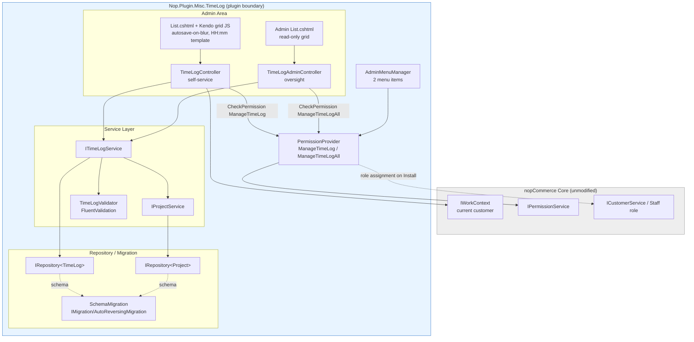

# Technical Design — Time Log Module

**Traces to:** `docs/time-log/requirements/clarified-requirement.md`, `docs/time-log/stories/user-stories.md`, `docs/time-log/acceptance-criteria/acceptance-criteria.md`
**Target nopCommerce version:** 4.90.8 (.NET 8, stable line)
**Feature slug:** `time-log`

## Stakeholder Decisions Incorporated (binding)

| # | Decision |
|---|---|
| 1 | `Project` entity does not exist — this feature defines and seeds it. Minimal fields only (`Id`, `Name`, `Active`); no admin CRUD UI in Phase 1. |
| 2 | Manager/admin oversight view is in scope now: new `ManageTimeLogAll` permission + separate admin grid/menu item, staff isolation unweakened. Granted to a distinct `Manager` customer role, created by the plugin at install time if it doesn't already exist (confirmed — see Step 4). |
| 3 | Single store — no `StoreMapping` on `TimeLog` or `Project`. |
| 4 | Time stored as precise `decimal` (no forced 2-decimal rounding); `HH:mm` reconstructed exactly from the stored decimal on display. |
| 5 | Confirmed new standalone plugin. |
| 6 | Deleting a Draft row requires a confirmation prompt (standard nopCommerce grid delete-confirm). |

---

## Step 1 — Placement Decision

| Placement | Applies? |
|---|---|
| New plugin | **YES — selected** |
| Extension of existing plugin | No — no existing time-tracking/HR/project plugin in this store (confirmed no overlap found in `src/Plugins/*`; none named Misc.TimeLog, HR, or ProjectManagement) |
| Plugin-based override of core behavior | No — feature introduces new entities/UI, not a behavioral override of existing core flows |
| Genuine core modification | No — not needed |

**Decision: New plugin — `Nop.Plugin.Misc.TimeLog`.**

**Justification:**
- Self-contained admin-only feature: new entities (`TimeLog`, `Project`), new permissions, new admin pages, no interaction with checkout/cart/order/catalog core logic.
- No existing plugin in this codebase covers time tracking or project management (verified — `src/Plugins/` contains payment/shipping/auth/discount/misc plugins only, none in this domain).
- Fits the standard nopCommerce "Misc" plugin category pattern (admin-only utility feature, e.g. similar shape to `Nop.Plugin.Misc.RFQ`).
- Zero core files require modification: role/permission seeding, new tables, and admin UI are all achievable through `IPlugin`/`IAdminMenuPlugin`, `IPermissionProvider`, `IMigration`, and standard `Nop.Web.Framework` MVC conventions inside the plugin.
- Per CLAUDE.md, options 1–3 are the default assumption and must be ruled out before considering option 4; option 4 is not applicable here since every requirement has a plugin-native mechanism.

No Core Modification Notice is required.

---

## Step 2 — Entity & Data Design

### Plugin project
`src/Plugins/Nop.Plugin.Misc.TimeLog/Nop.Plugin.Misc.TimeLog.csproj`

Folder layout (standard nopCommerce plugin shape):
```
Nop.Plugin.Misc.TimeLog/
  Domain/
    Project.cs
    TimeLog.cs
    TimeLogStatus.cs           (enum)
  Data/
    Migrations/
      SchemaMigration.cs        (MigrationVersion 001 — initial schema)
    TimeLogMapConfiguration.cs  (optional entity builder, Linq2Db mapping via NopEntityBuilder or IEntityBuilder)
    ProjectMapConfiguration.cs
  Services/
    ITimeLogService.cs / TimeLogService.cs
    IProjectService.cs / ProjectService.cs
  Areas/Admin/
    Controllers/TimeLogController.cs
    Controllers/TimeLogAdminController.cs   (manager oversight)
    Models/TimeLogModel.cs, TimeLogSearchModel.cs, ...
    Views/TimeLog/List.cshtml, _CreateOrUpdate...
  Infrastructure/
    NopStartup.cs               (DI registration, INopStartup)
    PermissionProvider.cs
    AdminMenuManager.cs         (IAdminMenu / SiteMapStartupFilter equivalent)
  Localization/
    ...resource seeding in Install()
  TimeLogPlugin.cs              (IPlugin / IAdminMenuPlugin)
  plugin.json
```

### Domain entities

**`Project`** (`Nop.Plugin.Misc.TimeLog.Domain.Project` — implements `BaseEntity`)
| Field | Type | Notes |
|---|---|---|
| Id | int | PK (identity) |
| Name | nvarchar(400) | Required |
| Active | bool | Default `true`; only Active projects populate the TimeLog dropdown |

No `StoreMapping`, no ACL entity restriction — per decision #3 (single store) and Project is a lookup table, not permission-scoped itself.

**Seeding (stakeholder-confirmed):** on plugin `InstallAsync()`, insert 3 sample Active placeholder projects so the feature is usable immediately (table must not start empty):
```csharp
var seedProjects = new[]
{
    new Project { Name = "General", Active = true },
    new Project { Name = "Internal", Active = true },
    new Project { Name = "Client Support", Active = true }
};
foreach (var project in seedProjects)
    await _projectService.InsertProjectAsync(project);
```
These are ordinary rows (not flagged/protected) — since Phase 1 has no Project CRUD UI, they can only be deactivated/edited via direct DB access until a later phase adds admin management; document this in `plugin.json`'s description and in the ticket for QA to validate the 3 seeded rows appear correctly in the Project dropdown after install. `UninstallAsync()` does not need to remove these rows for symmetry purposes — Project data is content, not configuration/registration state (same treatment nopCommerce gives other plugin-seeded lookup data); however, if the plugin is uninstalled the `Project`/`TimeLog` tables are dropped entirely by `AutoReversingMigration.Down()`, so the seed rows are removed as a side effect of schema teardown regardless.

**`TimeLog`** (`Nop.Plugin.Misc.TimeLog.Domain.TimeLog` — implements `BaseEntity`)
| Field | Type | Notes |
|---|---|---|
| Id | int | PK (identity) |
| CustomerId | int | FK → `Customer.Id`. Set server-side only from `IWorkContext.CurrentCustomer.Id`; never bound from client model on insert/update. |
| ProjectId | int | FK → `Project.Id`. Required; must resolve to an existing **and Active** project at validation time. |
| Task | nvarchar(400) | Required, non-empty |
| Description | nvarchar(max) | Optional |
| Date | DateTime (date only, stored as `DateTime` per nopCommerce convention) | Required; server defaults to `DateTime.UtcNow.Date` on insert if not supplied, editable |
| Time | decimal(5,4) | Required; range `0 <= Time <= 24` inclusive; **no forced rounding** — column precision chosen to hold exact proportional conversions (e.g., 20 min → 0.3333 truncated at 4 dp is still an approximation; see Note below) |
| StatusId | int | Backing field for `TimeLogStatus` enum (`Draft = 0`, `Submitted = 1`) — stored as `int` per nopCommerce enum-backing convention (mirrors `Order.OrderStatusId` pattern), with a `[NotMapped] Status` enum property |
| CreatedOnUtc | DateTime | Set once on insert |
| UpdatedOnUtc | DateTime | Refreshed on every successful insert/update/submit |

**Note on decimal precision (`decimal(9,6)` recommended, not `(5,4)`):** Decision #4 says store the precise value and reconstruct exact `HH:mm` without lossy rounding. Since `HH:mm` has 1-minute granularity, minutes-since-midnight is an exact integer 0–1440; `hours = minutes / 60m` is a repeating decimal for non-multiples of 60 (e.g., 20 min = 0.3333...). To reconstruct `HH:mm` exactly, the conversion must go **minutes → decimal → minutes** using `Math.Round(decimalValue * 60m, MidpointRounding.AwayFromZero)` at the minutes boundary only (never rounding the stored decimal itself for persistence/validation). Recommend column type `decimal(9,6)` (6 dp) — enough precision that round-tripping `minutes = round(hours*60)` always recovers the original integer minute value without the stored decimal needing to be "clean." This satisfies decision #4: the decimal is stored with enough precision to be lossless on the round trip, and the *conversion function*, not the storage, is responsible for exactness. Flag this precision choice to the developer/QA explicitly as it operationalizes an otherwise ambiguous stakeholder decision.

**`TimeLogStatus` enum**
```csharp
public enum TimeLogStatus
{
    Draft = 0,
    Submitted = 1
}
```

### Migrations (FluentMigrator, versioned — per nopCommerce `IMigration`/`MigrationVersion` pattern)

`Migrations/SchemaMigration.cs`
```csharp
[NopMigration("2025/01/01 00:00:00", "Nop.Plugin.Misc.TimeLog schema", MigrationProcessType.Installation)]
public class SchemaMigration : AutoReversingMigration
{
    public override void Up()
    {
        Create.TableFor<Project>();
        Create.TableFor<TimeLog>();
        // FK: TimeLog.ProjectId -> Project.Id
        Create.ForeignKey("FK_TimeLog_Project")
            .FromTable(NameCompatibilityManager.GetTableName(typeof(TimeLog))).ForeignColumn(nameof(TimeLog.ProjectId))
            .ToTable(NameCompatibilityManager.GetTableName(typeof(Project))).PrimaryColumn(nameof(Project.Id));
        // No FK constraint to core Customer table is added (nopCommerce convention: plugins reference Customer.Id
        // as a plain int FK column without a hard DB-level FK to core tables, consistent with e.g. Forums/Blog plugins).
    }
}
```
- Uses `AutoReversingMigration` so `Uninstall()` can call `Down()` automatically to drop both tables — satisfies Install/Uninstall symmetry.
- A second migration class is added only if a future schema change is needed post-release (never edit `SchemaMigration` after ship).

### Settings class
No externally-configurable settings are required for Phase 1 (no payment/shipping-style credentials, no admin-configurable toggle requested). If a future phase needs e.g. a configurable max Time value or default project, add `TimeLogSettings : ISettings` at that point — not created now, to avoid speculative scope.

### Store-mapping / ACL
- No `StoreMapping` per decision #3.
- No entity-level ACL (`ManageAcl`) — access is controlled entirely via the two `PermissionRecord`s (Step 4), not per-entity ACL rules.

---

## Step 3 — Service & Extension Point Design

### `IProjectService` / `ProjectService`
```csharp
public interface IProjectService
{
    Task<Project> GetProjectByIdAsync(int projectId);
    Task<IList<Project>> GetAllActiveProjectsAsync(); // cached, see Step 6
    Task<IPagedList<Project>> GetAllProjectsAsync(int pageIndex = 0, int pageSize = int.MaxValue); // reserved for future admin CRUD
    Task InsertProjectAsync(Project project);
    Task UpdateProjectAsync(Project project);
}
```

### `ITimeLogService` / `TimeLogService`
```csharp
public interface ITimeLogService
{
    // Staff self-service (row-owner scoped)
    Task<IPagedList<TimeLog>> GetOwnTimeLogsAsync(int customerId,
        DateTime? dateFrom = null, DateTime? dateTo = null,
        TimeLogStatus? status = null, int? projectId = null,
        int pageIndex = 0, int pageSize = 100);

    // Manager oversight (cross-staff)
    Task<IPagedList<TimeLog>> GetAllTimeLogsAsync(
        int? customerId = null, DateTime? dateFrom = null, DateTime? dateTo = null,
        TimeLogStatus? status = null, int? projectId = null,
        int pageIndex = 0, int pageSize = 100);

    // Ownership-checked single fetch — returns null if not found OR not owned by customerId
    Task<TimeLog> GetOwnTimeLogByIdAsync(int timeLogId, int customerId);

    // Manager fetch — no ownership filter, permission-gated at controller level instead
    Task<TimeLog> GetTimeLogByIdAsync(int timeLogId);

    Task InsertTimeLogAsync(TimeLog timeLog);
    Task UpdateTimeLogAsync(TimeLog timeLog);
    Task DeleteTimeLogAsync(TimeLog timeLog);

    // Bulk submit: validates ownership + Draft status + field rules per id; returns per-id result
    Task<IList<TimeLogSubmitResult>> SubmitTimeLogsAsync(IList<int> timeLogIds, int customerId);
}

public class TimeLogSubmitResult
{
    public int TimeLogId { get; set; }
    public bool Success { get; set; }
    public string ErrorMessage { get; set; }
}
```

Registration: both interfaces registered in `Infrastructure/NopStartup.cs` implementing `INopStartup`:
```csharp
public class NopStartup : INopStartup
{
    public void ConfigureServices(IServiceCollection services, IConfiguration configuration)
    {
        services.AddScoped<IProjectService, ProjectService>();
        services.AddScoped<ITimeLogService, TimeLogService>();
    }
    public void Configure(IApplicationBuilder application) { }
    public int Order => 3000; // after core services
}
```

### Domain events consumed
None required. This feature does not need to react to existing core events (no `OrderPlacedEvent`, no `EntityUpdatedEvent<Product>`, etc.) — it is a net-new admin data-entry feature, not a behavioral override.

### Widget zones
None — admin-only feature, no storefront rendering, so no `IWidgetPlugin`/`GetWidgetZones()` implementation is needed.

### Provider interfaces
Not applicable (no payment/shipping/tax integration).

---

## Step 4 — Admin & Storefront UI Design

### Permissions (`PermissionProvider : IPermissionProvider`)

| PermissionRecord SystemName | Purpose | Default role |
|---|---|---|
| `ManageTimeLog` | Staff self-service: view/create/edit/delete own Draft rows, submit own rows | `Staff` (create the role in `Install()` if it does not already exist, per requirement §2.1 — check via `ICustomerService.GetCustomerRoleBySystemNameAsync("Staff")` first) |
| `ManageTimeLogAll` | Manager oversight: read-only cross-staff visibility (Phase 1 scope is view-only — no edit/delete/submit on other staff's rows, since no requirement asked for manager edit rights) | `Manager` customer role — created by the plugin at install time if it does not already exist (stakeholder-confirmed, see decision below) |

**Manager role handling (stakeholder-confirmed):** `TimeLogPlugin.InstallAsync()` first checks for an existing `Manager` `CustomerRole` via `ICustomerService.GetCustomerRoleBySystemNameAsync("Manager")`. If found, the permission is simply mapped onto it (no role changes). If absent, the plugin creates it:
```csharp
var managerRole = await _customerService.GetCustomerRoleBySystemNameAsync(NopTimeLogDefaults.ManagerRoleSystemName);
var managerRoleCreatedByThisPlugin = managerRole is null;
if (managerRole is null)
{
    managerRole = new CustomerRole
    {
        Name = "Manager",
        SystemName = NopTimeLogDefaults.ManagerRoleSystemName, // "Manager"
        Active = true,
        IsSystemRole = false
    };
    await _customerService.InsertCustomerRoleAsync(managerRole);
}
```
- Same Staff-role-creation-if-missing pattern already applies to `Staff`/`ManageTimeLog` (§ existing design) — both roles follow identical "find-or-create" logic.
- **Uninstall symmetry (safe-removal rule):** `UninstallAsync()` always removes the `ManageTimeLogAll`→role permission mapping and the permission record itself (standard `UninstallPermissionsAsync`). It does **not** delete the `Manager` `CustomerRole` itself unconditionally, since another plugin/customization or manually-assigned customers could depend on it after this plugin is removed. Instead:
  - The plugin persists a small install-state flag (a `GenericAttribute` on the plugin's settings, e.g. `TimeLogManagerRoleCreatedByPlugin = true`) only when it created the role itself in `InstallAsync()`.
  - On `UninstallAsync()`, if that flag is `true` **and** no customers are currently assigned to the `Manager` role (`_customerService.GetCustomerRoleByIdAsync` + a count check via `ICustomerService.GetOnlyCustomerRoleIdsAsync`/`GetAllCustomersAsync` filtered by role), the plugin deletes the role it created. If the flag is `false` (role pre-existed) or the role has any assigned customers, the role is left in place untouched — only the permission mapping and `ManageTimeLogAll` permission record are removed, guaranteeing no orphaned permission mappings without risking deletion of a role in active use elsewhere.

```csharp
public class PermissionProvider : IPermissionProvider
{
    public static readonly PermissionRecord ManageTimeLog = new()
    {
        Name = "Manage Time Log (own)",
        SystemName = "ManageTimeLog",
        Category = "Time Log"
    };
    public static readonly PermissionRecord ManageTimeLogAll = new()
    {
        Name = "Manage Time Log (all staff)",
        SystemName = "ManageTimeLogAll",
        Category = "Time Log"
    };

    public IEnumerable<PermissionRecord> GetPermissions() => new[] { ManageTimeLog, ManageTimeLogAll };

    public HashSet<(PermissionRecord, IEnumerable<PermissionRecord>)> GetDefaultPermissions()
        // Explicit: PermissionProvider.GetDefaultPermissions maps a CustomerRole -> permissions.
        // Actual role resolution/creation ("Staff") happens in TimeLogPlugin.Install() since
        // GetDefaultPermissions works off role SystemNames that must already exist by install time.
        => new() {
            (StaffRoleStub, new[] { ManageTimeLog }),
            (AdminRoleStub, new[] { ManageTimeLogAll })
        };
}
```
Install/uninstall symmetry: `TimeLogPlugin.InstallAsync()` calls `_permissionService.InstallPermissionsAsync(new PermissionProvider())`; `UninstallAsync()` calls `_permissionService.UninstallPermissionsAsync(new PermissionProvider())`. Staff-role creation-if-missing is done explicitly in `InstallAsync()` before permission assignment, not left to `GetDefaultPermissions()` alone.

### Manager oversight — design choice: **separate admin menu item + separate grid/controller**, not a mode toggle

**Decision: two distinct admin pages** (`TimeLogController` for self-service, `TimeLogAdminController` for oversight), each with its own menu entry, gated by its own permission.

**Reasoning:**
- A single-page mode toggle would require the same view/controller to branch behavior (query scope, editability, columns) based on which permission the current user holds — this mixes two different authorization and data-access paths in one action, increasing the risk of accidentally leaking cross-user edit capability if the toggle logic has a bug (directly undermines the "do not weaken staff row-level isolation" requirement).
- Separate controllers keep the row-level ownership filter (`GetOwnTimeLogsAsync`) physically isolated from the oversight query (`GetAllTimeLogsAsync`) — a staff-only user literally cannot reach the oversight action because `[AuthorizeAdmin]` + permission check on `ManageTimeLogAll` blocks it at the controller/action level, not via a hidden UI toggle.
- Matches standard nopCommerce admin pattern of one controller/view per distinct permission-gated capability (e.g., separate Orders vs. Order oversight-style split does not exist in core, but the plugin ecosystem convention — e.g., separate list vs. detail controllers — favors explicit separation over conditional UI).
- A user holding both permissions (e.g., a manager who also logs their own time) simply sees two menu items — acceptable and clearer than a toggle that could confuse which scope is currently active.

### Admin menu (`AdminMenuManager` / `IAdminMenuPlugin` — hooking into `SiteMap.xml`-equivalent via `ManageSiteMap` or `IAdminMenuPlugin.ManageSiteMapAsync`)

| Menu item | Permission gate | Route |
|---|---|---|
| "Log Time" | `ManageTimeLog` | `Admin/TimeLog/List` |
| "Time Logs (All Staff)" | `ManageTimeLogAll` | `Admin/TimeLogAdmin/List` |

Both appear under a new top-level "Time Log" section (or nested under an existing suitable section if the store's menu convention favors grouping — default to a new top-level entry since this is a standalone feature per decision #5).

### Controllers

**`TimeLogController`** (`Areas/Admin/Controllers`)
- `[Area(AreaNames.ADMIN)] [AuthorizeAdmin] [AutoValidateAntiforgeryToken]`
- Actions: `List()` (view shell), `TimeLogList(TimeLogSearchModel)` (AJAX grid read), `TimeLogInsert`, `TimeLogUpdate`, `TimeLogDelete`, `TimeLogSubmit` (bulk) — each individually decorated with `[CheckPermission(TimeLogPermissionProvider.ManageTimeLog)]` (nopCommerce's `CheckPermissionAttribute` pattern) in addition to the antiforgery token on POSTs.
- Every action resolves `CustomerId` from `_workContext.GetCurrentCustomerAsync()` — never from the posted model — and passes it into the service layer's owner-scoped methods.

**`TimeLogAdminController`** (`Areas/Admin/Controllers`)
- `[Area(AreaNames.ADMIN)] [AuthorizeAdmin]`
- Actions: `List()`, `TimeLogList(TimeLogAdminSearchModel)` — **read-only** (no insert/update/delete/submit actions exposed at all in Phase 1, since no requirement asked for manager-side mutation). `[CheckPermission(TimeLogPermissionProvider.ManageTimeLogAll)]`.
- Search model additionally exposes a Customer (staff member) filter dropdown, absent from the staff self-service grid by design (AC-8 explicitly says no customer filter is exposed on the self-service grid).

### Kendo Grid Architecture

**Self-service grid (`TimeLogController`)**
- AJAX-bound Kendo grid (`Html.Kendo().Grid<TimeLogModel>()`), `DataSource.Ajax()` with `.Read(...).Create(...).Update(...).Destroy(...)` bound to `TimeLogList`/`TimeLogInsert`/`TimeLogUpdate`/`TimeLogDelete`.
- Columns: selection checkbox (bound to a computed `Selectable` flag = `Status == Draft`), Date, Project (name, populated from a `SelectList` sourced via `IProjectService.GetAllActiveProjectsAsync()`), Task, Description, Time (custom template, see below), Status (display-only, localized text).
- **Inline insert/update**: `Editable("popup: false")` inline row editing per standard nopCommerce Kendo pattern; new-row defaults (`Date = today`, `Status = Draft`) set via the model's `TimeLogSearchModel`/`TimeLogModel` default constructor or `[DataSource].ServerFiltering` default supplied by the `TimeLogInsert` GET-model preparer.
- **Autosave on blur** (deviation from stock pattern): custom JS in `Views/TimeLog/List.cshtml` (or a dedicated `timelog-grid.js` under the plugin's `Content/Scripts`) attaches to the grid's row editing lifecycle:
  ```js
  grid.table.on('focusout', 'tr.k-grid-edit-row', function (e) {
      var row = $(e.currentTarget).closest('tr');
      // debounce to allow Kendo's own blur-driven cell validation to run first
      setTimeout(function () {
          if (!$(row).find(':focus').length) {
              grid.saveRow(); // triggers Kendo's built-in client validation, then the Update transport call, only if valid
          }
      }, 150);
  });
  ```
  `grid.saveRow()` internally invokes Kendo's own validation (`Validatable`) before firing the transport `Update`/`Create` call, so AC-4.2 (invalid data never autosaves) is satisfied by the existing Kendo validation pipeline — the custom JS only changes *when* save is triggered (blur vs. explicit button), not *whether* validation runs.
- **`HH:mm` ⇄ decimal binding**: implemented at the Kendo column level via `.Field(...).Template(...) ` + a custom editor:
  - Grid column: `columns.Bound(m => m.TimeDisplay).Title("Time")` where `TimeDisplay` is a `[NotMapped]`/view-model-only string computed by the model preparer as `TimeSpan.FromMinutes(Math.Round(model.Time * 60m)).ToString(@"hh\:mm")`.
  - Custom Kendo editor template (`EditorTemplates/TimeHHmm.cshtml`) renders a masked text input; client-side JS parses `HH:mm` → decimal on change (`parts[0]*1 + parts[1]/60`) and writes it into a hidden `Time` field bound to the model before `saveRow()` submits.
  - Server-side model binder/validator always receives and validates the **decimal** `Time` field — the `HH:mm` string never reaches server-side validation directly (per requirement §5.5 / §6, conversion is UI-layer only).

**Manager oversight grid (`TimeLogAdminController`)**
- Same column set plus a Customer (staff name) column, **read-only** (`Editable(false)`, no checkboxes, no Submit button) — pure reporting/list view in Phase 1.
- Filters: time range, status, project, **plus** Customer/staff member (dropdown of Staff-role customers).

### Bulk Submit endpoint
- `POST Admin/TimeLog/TimeLogSubmit` accepts `int[] selectedIds`.
- Controller resolves current customer, calls `ITimeLogService.SubmitTimeLogsAsync(selectedIds, currentCustomerId)`.
- Service iterates each id: loads via **owner-scoped** fetch (`GetOwnTimeLogByIdAsync`, i.e., a query that filters by both `Id` and `CustomerId` in the same WHERE clause, not a fetch-then-check-in-memory) — if not found (wrong owner or missing), records a per-id failure without throwing; else re-validates required fields + 0–24 range using the same validator used on insert/update; on success sets `Status = Submitted`, `UpdatedOnUtc = DateTime.UtcNow`, persists, records success.
- Returns a per-id result list so the grid can surface which rows failed (AC-9.3).
- Grid's JS refreshes (`grid.dataSource.read()`) after the response regardless of partial failure, so newly Submitted rows immediately render read-only.

### Delete confirmation (decision #6)
Standard nopCommerce Kendo grid delete-confirm pattern: `columns.Command(command => command.Destroy())` with the grid's default `Messages.Commands.Destroy` bound to a confirm dialog (nopCommerce admin theme already wires a confirm prompt on `k-grid-delete-command` via `admin.js` — reuse that, no custom confirm dialog needed). Delete button/command only rendered for rows where `Status == Draft` (server-supplied model flag, not a client-only check).

### Server-side enforcement points (summary — see also Step 3 service signatures)

| Concern | Enforcement point |
|---|---|
| Row-level ownership (staff can't touch others' records even via crafted request) | Every self-service read/update/delete/submit service method takes `customerId` as an explicit parameter and filters at the **repository query** level (`Where(t => t.Id == id && t.CustomerId == customerId)`), never a fetch-by-id-then-compare-in-app-code pattern that could be refactored away — not-found and wrong-owner both return "not found" (no information leak distinguishing the two) |
| Draft-only editability | `TimeLogService.UpdateTimeLogAsync`/`DeleteTimeLogAsync` re-check `existingEntity.StatusId == (int)TimeLogStatus.Draft` immediately before persisting, independent of what the controller/grid UI allowed; reject with a validation error otherwise |
| Submitted immutability | Same check as above — Submitted rows fail the Draft-status guard on any write path (update, delete, and submit-again) |
| Bulk Submit re-validation | `SubmitTimeLogsAsync` re-runs the full field validator (Project active + exists, Task non-empty, Time 0–24, Date present) per record before flipping status — does not trust client-side validation state at all |
| Project must be Active | Validator calls `IProjectService.GetProjectByIdAsync` and checks `Active == true` on every insert/update/submit, not only at dropdown-population time |

Validation logic is centralized in a single `TimeLogValidator` (FluentValidation, per nopCommerce convention — e.g. `Nop.Web.Framework.Validators`) shared by insert, update, and submit code paths, so the 0–24/required-field rules are defined exactly once.

### Localization resource keys (seeded in `Install()`, removed in `Uninstall()`)

```
Admin.TimeLog.Menu.LogTime
Admin.TimeLog.Menu.AllStaffTimeLogs
Admin.TimeLog.Fields.Date
Admin.TimeLog.Fields.Project
Admin.TimeLog.Fields.Task
Admin.TimeLog.Fields.Description
Admin.TimeLog.Fields.Time
Admin.TimeLog.Fields.Status
Admin.TimeLog.Fields.Customer            (oversight grid only)
Admin.TimeLog.Status.Draft
Admin.TimeLog.Status.Submitted
Admin.TimeLog.Validation.ProjectRequired
Admin.TimeLog.Validation.ProjectInvalidOrInactive
Admin.TimeLog.Validation.TaskRequired
Admin.TimeLog.Validation.TimeRequired
Admin.TimeLog.Validation.TimeOutOfRange
Admin.TimeLog.Validation.DateRequired
Admin.TimeLog.Validation.RecordNotEditable       ("This record can no longer be edited because it has been submitted.")
Admin.TimeLog.Validation.RecordNotFound
Admin.TimeLog.Submit.Button
Admin.TimeLog.Submit.SuccessMessage
Admin.TimeLog.Submit.PartialFailureMessage
Admin.TimeLog.Grid.DeleteConfirm
Admin.TimeLog.Filter.DateFrom
Admin.TimeLog.Filter.DateTo
Admin.TimeLog.Filter.Status
Admin.TimeLog.Filter.Project
Admin.TimeLog.Filter.Customer                     (oversight grid only)
Permission.ManageTimeLog
Permission.ManageTimeLogAll
```
No hardcoded strings appear in views/JS templates/validators — all resolved via `ILocalizationService`/`@T(...)`/`Html.Kendo()...Title(await T("..."))`.

---

## Step 5 — Architecture Diagram



---

## Caching & Pagination

- `IProjectService.GetAllActiveProjectsAsync()` is cached via `IStaticCacheManager` under a plugin-defined cache key (e.g. `NopTimeLogDefaults.ActiveProjectsCacheKey`), following the standard `_staticCacheManager.GetAsync(cacheKey, () => ...)` pattern used across nopCommerce services.
- Cache invalidation: since Phase 1 has no Project CRUD UI, the cache is only invalidated on plugin update/reinstall or a manual `IStaticCacheManager.RemoveByPrefixAsync` call wired into any future Project-editing action. Document this as a known gap to revisit once/if a Project admin CRUD screen is added (flagged, not built, per decision #1).
- Both grids (self-service and oversight) use standard nopCommerce Kendo `DataSourceRequest` paging; server-side `pageSize` is capped at 100 (`AdminAntiForgery`-style guard: service methods clamp any requested `pageSize > 100` down to 100 before querying) — satisfies the "max 100 items" performance rule regardless of what the grid requests.
- Both `GetOwnTimeLogsAsync` and `GetAllTimeLogsAsync` build their filter (date range, status, project, [oversight-only] customer) directly in the repository `Table` LINQ expression to avoid N+1s and to keep row-level ownership filtering as part of the single query (not client-side/post-fetch filtering).

---

## Open Questions — Resolved (stakeholder sign-off received)

1. **"Manager" role existence** — Resolved: plugin creates a distinct `Manager` customer role at install time if one doesn't already exist (find-or-create, mirroring the `Staff` role pattern), and grants `ManageTimeLogAll` to it. Uninstall removes the permission mapping unconditionally but only deletes the role itself if this plugin created it and no customers are currently assigned to it (see Step 4 for full logic). No longer open.
2. **Time rounding precision** — Resolved: `decimal(9,6)` storage with `round(hours*60)/60` minute round-trip reconstruction, confirmed as designed. No longer open.
3. **Project seed data** — Resolved: plugin seeds 3 sample Active placeholder projects ("General", "Internal", "Client Support") on install; table must not start empty. No longer open.

No open questions remain blocking implementation planning.
