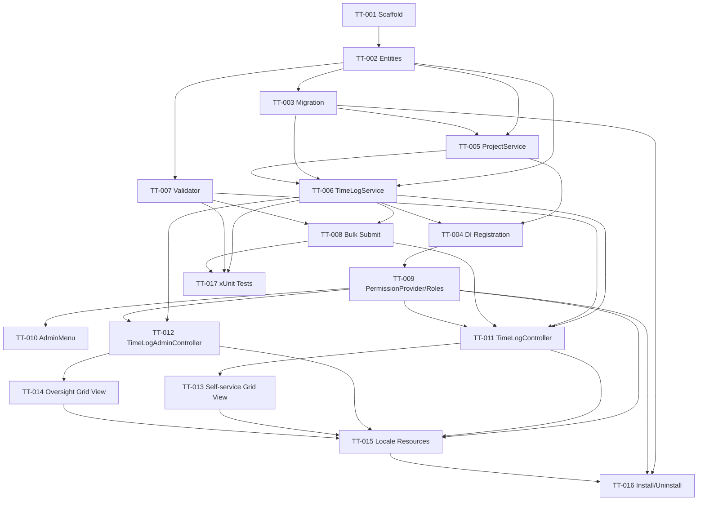

# Implementation Plan — Time Log Module

**Traces to:** `docs/time-log/design/technical-design.md`, `docs/time-log/tickets/tickets.md` (T-001–T-013), `docs/time-log/stories/user-stories.md`, `docs/time-log/acceptance-criteria/acceptance-criteria.md`
**Target nopCommerce version:** 4.90.8 (.NET 8, stable line)
**Placement:** Entire feature is Placement category 1 — new standalone plugin `Nop.Plugin.Misc.TimeLog`. No core files are touched anywhere in this plan; **no core-modification tasks exist in this plan** (nothing to flag at the top per the CORE-flag rule).

All tasks below carry `task-type: new-plugin` (there is no `modify-existing`/core work in this feature — confirmed by the SA design's Step 1 Placement Decision). Tasks are organized by nopCommerce layer/component per the plugin folder layout in the design doc, not by story, since most stories cut across several layers; each task lists which Story ticket(s) it implements.

---

## Version & Compatibility Notes (Step 3 check)

- All tasks target **4.90.8 / .NET 8**. DI registration uses `INopStartup` (current 4.90.x pattern, not the legacy `IDependencyRegistrar` used pre-4.30) — flagged explicitly on TT-004 so the developer agent does not default to `IDependencyRegistrar`.
- Admin menu integration uses `IAdminMenuPlugin`/`SiteMap`-provider pattern current to 4.90.x — flagged on TT-010.
- Migrations use `FluentMigrator`-backed `NopMigration`/`AutoReversingMigration` attributes, current 4.90.x pattern — flagged on TT-003.
- No task in this plan has a version-dependent branch; all follow the single 4.90.8 approach the design already committed to.

---

## Build Order (dependency-respecting sequence)

```
Phase 0 — Scaffold
  TT-001 Plugin project scaffold + plugin.json

Phase 1 — Domain & Schema (nothing else compiles without these)
  TT-002 Domain entities (Project, TimeLog, TimeLogStatus)
      depends on: TT-001
  TT-003 Schema migration (SchemaMigration : AutoReversingMigration)
      depends on: TT-002

Phase 2 — Services + DI (depends on entities/schema)
  TT-005 IProjectService / ProjectService (incl. caching)
      depends on: TT-002, TT-003
  TT-006 ITimeLogService / TimeLogService (core CRUD + ownership-scoped queries)
      depends on: TT-002, TT-003, TT-005
  TT-007 TimeLogValidator (FluentValidation, centralized rules)
      depends on: TT-002
  TT-008 Bulk Submit logic (SubmitTimeLogsAsync + TimeLogSubmitResult)
      depends on: TT-006, TT-007
  TT-004 NopStartup DI registration (INopStartup)
      depends on: TT-005, TT-006

Phase 3 — Permissions & Menu (depends on services existing to gate)
  TT-009 PermissionProvider + Staff/Manager role find-or-create install logic
      depends on: TT-004
  TT-010 AdminMenuManager (2 permission-gated menu items)
      depends on: TT-009

Phase 4 — Admin UI: Controllers (depends on services + permissions)
  TT-011 TimeLogController (self-service) + view models
      depends on: TT-006, TT-007, TT-008, TT-009
  TT-012 TimeLogAdminController (oversight, read-only)
      depends on: TT-006, TT-009

Phase 5 — Admin UI: Views/Grids (can run in parallel with each other once controllers stable)
  TT-013 Self-service Kendo grid view + JS (autosave-on-blur, HH:mm editor template, filters)
      depends on: TT-011
  TT-014 Oversight Kendo grid view (read-only, Customer filter)
      depends on: TT-012

Phase 6 — Localization (depends on all resource-key producing work being finalized)
  TT-015 Locale resource seeding (all Admin.TimeLog.* / Permission.* keys)
      depends on: TT-009, TT-011, TT-012, TT-013, TT-014

Phase 7 — Install/Uninstall wiring (last — references everything above)
  TT-016 TimeLogPlugin.InstallAsync/UninstallAsync symmetry
      (migrations, roles, permissions, seed data, locale resources, GenericAttribute flag)
      depends on: TT-003, TT-009, TT-015

Phase 8 — Tests (can start as soon as the layer under test is stable; final gate before QA handoff)
  TT-017 xUnit tests (validator, service ownership filters, bulk submit, decimal<->HH:mm conversion)
      depends on: TT-006, TT-007, TT-008
```

Dependency graph (condensed):



---

## Task List by Component

### Phase 0 — Scaffold

**TT-001 — Plugin project scaffold + plugin.json**
- task-type: `new-plugin`
- Implements: T-013
- Description: Create `src/Plugins/Nop.Plugin.Misc.TimeLog/Nop.Plugin.Misc.TimeLog.csproj` with the full folder layout from the design doc (`Domain/`, `Data/Migrations/`, `Services/`, `Areas/Admin/Controllers`, `Areas/Admin/Models`, `Areas/Admin/Views`, `Infrastructure/`, `Localization/`, `TimeLogPlugin.cs`, `plugin.json`). Populate `plugin.json` fully: `Group=Misc`, `FriendlyName=Time Log`, `SystemName=Misc.TimeLog`, `Version`, `SupportedVersions=["4.90"]`, `Author`, `DisplayOrder`, `FileName`, `Description` (include the note about seeded Project rows having no CRUD UI in Phase 1, per design Step 2).
- Dependencies: None.
- Version notes: 4.90.8 plugin project shape (SDK-style csproj referencing `Nop.Web.Framework`/`Nop.Services`).
- Verification: Plugin project builds; appears in `Admin > Configuration > Plugins` list as "not installed" before TT-016 runs.

### Phase 1 — Domain & Schema

**TT-002 — Domain entities**
- task-type: `new-plugin`
- Implements: T-013 (foundation for T-001, T-003–T-012 indirectly)
- Description: Add `Domain/Project.cs`, `Domain/TimeLog.cs` (both `BaseEntity`), `Domain/TimeLogStatus.cs` enum exactly per design Step 2 field tables, including the `[NotMapped] Status` enum property backed by `StatusId`, and `decimal(9,6)` precision intent for `Time` (actual column type applied in TT-003 migration).
- Dependencies: TT-001.
- Verification: Entities compile; `Time` field documented (code comment) with the resolved `decimal(9,6)` precision rationale from design Step 2 note, so no developer re-introduces 2-dp rounding.

**TT-003 — Schema migration**
- task-type: `new-plugin`
- Implements: T-013
- Description: `Data/Migrations/SchemaMigration.cs` — `[NopMigration("2025/01/01 00:00:00", "Nop.Plugin.Misc.TimeLog schema", MigrationProcessType.Installation)]`, `AutoReversingMigration`, `Create.TableFor<Project>()`, `Create.TableFor<TimeLog>()`, FK `TimeLog.ProjectId -> Project.Id` per design snippet. Confirm `Time` column type is `decimal(9,6)` (not `(5,4)` — design doc explicitly corrects this).
- Dependencies: TT-002.
- Version notes: `AutoReversingMigration` pattern is current 4.90.x FluentMigrator convention — flag to developer that `Down()` is auto-generated, not hand-written.
- Verification: Installing the plugin creates both tables with correct columns/FK; uninstalling drops both tables cleanly (test after TT-016 wires install/uninstall).

### Phase 2 — Services & Validation

**TT-004 — NopStartup DI registration**
- task-type: `new-plugin`
- Implements: T-013
- Description: `Infrastructure/NopStartup.cs` implementing `INopStartup` (NOT `IDependencyRegistrar` — 4.90.8 uses `INopStartup`), registers `IProjectService`/`ProjectService` and `ITimeLogService`/`TimeLogService` as scoped, `Order = 3000` (after core services) per design snippet.
- Dependencies: TT-005, TT-006.
- Version notes: **Flagged** — confirm `INopStartup` is correct for 4.90.8 (it is; do not use the legacy `IDependencyRegistrar` pattern from pre-4.30 versions).
- Verification: Services resolve via constructor injection in controllers without manual registration elsewhere.

**TT-005 — IProjectService / ProjectService**
- task-type: `new-plugin`
- Implements: T-003, T-009 (project dropdown/filter data), T-013 (seed data insert path)
- Description: Implement per design Step 3 interface signature exactly (`GetProjectByIdAsync`, `GetAllActiveProjectsAsync` cached via `IStaticCacheManager`, `GetAllProjectsAsync` paged/reserved, `InsertProjectAsync`, `UpdateProjectAsync`). Cache key defined in `NopTimeLogDefaults.ActiveProjectsCacheKey`.
- Dependencies: TT-002, TT-003.
- Verification: `GetAllActiveProjectsAsync` returns only `Active = true` rows and is cached (confirm cache hit on repeat call without DB round-trip via debug/log).

**TT-006 — ITimeLogService / TimeLogService**
- task-type: `new-plugin`
- Implements: T-003, T-004, T-005 (partially — save path), T-007, T-008, T-009
- Description: Implement per design Step 3 exactly: `GetOwnTimeLogsAsync`, `GetAllTimeLogsAsync`, `GetOwnTimeLogByIdAsync` (ownership filter **in the repository WHERE clause**, not fetch-then-compare), `GetTimeLogByIdAsync` (manager fetch, no ownership filter — permission-gated at controller), `InsertTimeLogAsync`, `UpdateTimeLogAsync` (re-checks `StatusId == Draft` before persisting), `DeleteTimeLogAsync` (same Draft re-check). Filter building (date range/status/project/[oversight] customer) done directly in the repository LINQ expression per Caching & Pagination section — no N+1s, no post-fetch filtering. Clamp any requested `pageSize > 100` to 100 server-side.
- Dependencies: TT-002, TT-003, TT-005.
- Verification: Crafted request against another customer's TimeLog Id on update/delete returns not-found with no info leak distinguishing "not found" vs "wrong owner" (AC-2.3); Submitted-row update/delete rejected independent of UI (AC-7.2).

**TT-007 — TimeLogValidator (FluentValidation)**
- task-type: `new-plugin`
- Implements: T-011
- Description: Single centralized validator per design Step 4 — Project required + must exist + `Active == true`; Task required non-empty; Time 0–24 inclusive (decimal, no forced rounding); Date required. Shared by insert, update, and submit code paths (called from TT-006 and TT-008), so the rule set is defined exactly once.
- Dependencies: TT-002.
- Verification: Each of the 4 rules independently rejects invalid input with the correct localized message key from TT-015; validator invoked identically from insert/update/submit call sites (no duplicated inline rule logic elsewhere).

**TT-008 — Bulk Submit (SubmitTimeLogsAsync)**
- task-type: `new-plugin`
- Implements: T-010
- Description: `ITimeLogService.SubmitTimeLogsAsync(IList<int> timeLogIds, int customerId)` per design — for each id: owner-scoped fetch, re-run full `TimeLogValidator`, re-check `Active` project, on success set `Status = Submitted` + refresh `UpdatedOnUtc`, else record per-id `TimeLogSubmitResult` failure without throwing. Never trusts client-side validation state.
- Dependencies: TT-006, TT-007.
- Verification: Mixed valid/invalid/tampered-id selection submitted in one call returns correct per-id success/failure list (AC-9.2–9.4); zero-selection call is a no-op guarded at controller level too (TT-011).

### Phase 3 — Permissions & Menu

**TT-009 — PermissionProvider + role find-or-create install logic**
- task-type: `new-plugin`
- Implements: T-001, T-013
- Description: `Infrastructure/PermissionProvider.cs` implementing `IPermissionProvider` with `ManageTimeLog`/`ManageTimeLogAll` `PermissionRecord`s and `GetDefaultPermissions()` per design snippet. The actual Staff/Manager role find-or-create logic (via `ICustomerService.GetCustomerRoleBySystemNameAsync`) is implemented here as reusable methods but **invoked from `TimeLogPlugin.InstallAsync()`** (TT-016), since `GetDefaultPermissions()` needs the role SystemNames to already exist. Include the `TimeLogManagerRoleCreatedByPlugin` `GenericAttribute` flag write during install (flag itself is set in TT-016, defined here as a `NopTimeLogDefaults` constant).
- Dependencies: TT-004.
- Verification: Fresh store without Staff/Manager roles: both created on install and permissions mapped correctly (AC-1.1); store with pre-existing roles: no duplicate role created, permission merely mapped.

**TT-010 — AdminMenuManager**
- task-type: `new-plugin`
- Implements: T-002
- Description: Register two permission-gated menu items ("Log Time" → `Admin/TimeLog/List`, gated `ManageTimeLog`; "Time Logs (All Staff)" → `Admin/TimeLogAdmin/List`, gated `ManageTimeLogAll`) under a new top-level "Time Log" section, via the plugin's `IAdminMenuPlugin`/site-map hook.
- Dependencies: TT-009.
- Version notes: Confirm the 4.90.x site-map/admin-menu extension mechanism (`IAdminMenuPlugin` or `ManageSiteMap` interface, per what's current in 4.90.8 — flagged for the developer to verify against the installed nopCommerce source rather than assume from memory of older versions).
- Verification: Menu item visibility toggles correctly per permission (AC-1.2); clicking opens the grid directly, no intermediate page (AC-1.4).

### Phase 4 — Admin Controllers

**TT-011 — TimeLogController (self-service)**
- task-type: `new-plugin`
- Implements: T-003, T-004, T-005, T-007, T-008, T-009, T-010, T-011
- Description: `Areas/Admin/Controllers/TimeLogController.cs` — `[Area(AreaNames.ADMIN)] [AuthorizeAdmin] [AutoValidateAntiforgeryToken]`. Actions: `List()`, `TimeLogList(TimeLogSearchModel)` (AJAX read, filters: date range/status/project — AC-8), `TimeLogInsert`, `TimeLogUpdate`, `TimeLogDelete`, `TimeLogSubmit` (bulk, empty-selection no-op guard at this layer too). Every action individually `[CheckPermission(ManageTimeLog)]`; `CustomerId` always resolved from `IWorkContext.GetCurrentCustomerAsync()`, never from the posted model. Build `TimeLogModel`/`TimeLogSearchModel` view models including the computed `TimeDisplay` (`HH:mm`) field and server-supplied `Selectable`/delete-affordance flags (`Status == Draft`).
- Dependencies: TT-006, TT-007, TT-008, TT-009.
- Verification: Direct URL access without `ManageTimeLog` returns authorization failure, not a rendered grid (AC-1.3); insert defaults Date=today/Status=Draft with server-set CustomerId/timestamps (AC-3); Submitted rows have no edit/delete affordance server-side (AC-7.1).

**TT-012 — TimeLogAdminController (oversight)**
- task-type: `new-plugin`
- Implements: T-012
- Description: `Areas/Admin/Controllers/TimeLogAdminController.cs` — `[Area(AreaNames.ADMIN)] [AuthorizeAdmin] [CheckPermission(ManageTimeLogAll)]`. Actions: `List()`, `TimeLogList(TimeLogAdminSearchModel)` only — **no** insert/update/delete/submit actions exist at all (read-only by omission, not by disabled UI). Search model adds a Customer/staff filter dropdown absent from the self-service model.
- Dependencies: TT-006, TT-009.
- Verification: Manager-role user sees cross-staff entries with working Customer filter; Staff-only user cannot reach this controller/action even via direct URL (permission check, not hidden menu item alone).

### Phase 5 — Admin Views/Grids

**TT-013 — Self-service Kendo grid view + JS**
- task-type: `new-plugin`
- Implements: T-004, T-005, T-006, T-009
- Description: `Views/TimeLog/List.cshtml` with AJAX-bound Kendo grid (`Editable("popup: false")` inline), columns per design (selection checkbox bound to `Selectable`, Date, Project dropdown sourced from `IProjectService.GetAllActiveProjectsAsync()`, Task, Description, Time via `EditorTemplates/TimeHHmm.cshtml` custom editor, Status). Custom `timelog-grid.js` (plugin `Content/Scripts`) implementing the `focusout` → debounced `grid.saveRow()` autosave-on-blur handler from the design snippet, plus the `HH:mm` ⇄ decimal client-side conversion (`parts[0]*1 + parts[1]/60`) feeding a hidden `Time` field. Delete command uses stock nopCommerce Kendo grid confirm-delete wiring (`admin.js`), rendered only for Draft rows (decision #6).
- Dependencies: TT-011.
- Verification: Autosave fires on blur only when Kendo client validation passes (AC-4.1/4.2); `HH:mm` round-trips exactly including non-terminating values like 20 minutes (AC-5, T-006 note); delete confirm dialog appears before a Draft row is removed (AC-6.1); Submitted rows render fully read-only including disabled checkbox (AC-7.1, AC-9.1).

**TT-014 — Oversight Kendo grid view**
- task-type: `new-plugin`
- Implements: T-012
- Description: Admin oversight `List.cshtml` — same column set as TT-013 plus Customer (staff name) column, `Editable(false)`, no checkboxes, no Submit button. Filters: time range, status, project, plus Customer/staff dropdown (Staff-role customers only).
- Dependencies: TT-012.
- Verification: Grid is read-only end-to-end (no client-side edit affordance rendered at all, not just server-blocked); Customer filter narrows results correctly.

### Phase 6 — Localization

**TT-015 — Locale resource seeding**
- task-type: `new-plugin`
- Implements: T-013 (all stories indirectly — every user-facing string)
- Description: Add the full resource key list from design Step 4 (`Admin.TimeLog.Menu.*`, `Admin.TimeLog.Fields.*`, `Admin.TimeLog.Status.*`, `Admin.TimeLog.Validation.*`, `Admin.TimeLog.Submit.*`, `Admin.TimeLog.Grid.DeleteConfirm`, `Admin.TimeLog.Filter.*`, `Permission.ManageTimeLog`, `Permission.ManageTimeLogAll`) as an embedded resource/seed list consumed by `InstallAsync()`/`UninstallAsync()` via `ILocalizationService`. Confirm zero hardcoded strings exist in any view/JS/validator from TT-007/011/012/013/014 by this point — this task is also the checkpoint task for that CLAUDE.md rule.
- Dependencies: TT-009, TT-011, TT-012, TT-013, TT-014.
- Verification: All keys present in `Admin > Configuration > Languages > Resources` after install; all views/validators reference `@T(...)`/`ILocalizationService`, no literal UI strings; keys removed on uninstall.

### Phase 7 — Install/Uninstall Lifecycle

**TT-016 — TimeLogPlugin.InstallAsync/UninstallAsync**
- task-type: `new-plugin`, **install/uninstall symmetry is the explicit acceptance gate for this task**
- Implements: T-013 (primary), foundational precondition for T-001–T-012 being testable at all
- Description: `TimeLogPlugin.cs` (`IPlugin`, `IAdminMenuPlugin` link to TT-010). `InstallAsync()`: run migration (via base `IPlugin.InstallAsync` + `SchemaMigration`), find-or-create Staff role or reuse existing (mirrors existing pattern for `ManageTimeLog`), find-or-create Manager role (TT-009 logic) with `TimeLogManagerRoleCreatedByPlugin` GenericAttribute flag set `true` only when created by this install, `_permissionService.InstallPermissionsAsync(new PermissionProvider())`, seed 3 Active `Project` rows ("General", "Internal", "Client Support") via `IProjectService.InsertProjectAsync`, seed all TT-015 locale resources. `UninstallAsync()`: `_permissionService.UninstallPermissionsAsync(...)`, remove locale resources, and — only if the GenericAttribute flag is `true` **and** zero customers are currently assigned to the Manager role — delete the Manager role; otherwise leave the role untouched. Schema teardown (`AutoReversingMigration.Down()`) drops `Project`/`TimeLog` tables as a side effect, which also removes the 3 seed rows (no separate cleanup needed for seed data per design's explicit non-requirement).
- Dependencies: TT-003, TT-009, TT-015.
- Verification: Fresh install on a store without Staff/Manager roles/Project table performs every step above; the 3 seed projects appear correctly in the Project dropdown (TT-005/TT-013) after install; uninstall test covers **both** branches — role created-by-plugin-and-unassigned (deleted) and role pre-existing-or-in-use (retained) — plus confirms permission records/mappings/locale resources are fully removed and both tables dropped.
- Notes (carried forward per CLAUDE.md — no Core Modification Notice needed, all logic is plugin-internal `IPlugin.InstallAsync/UninstallAsync` + `IMigration`, consistent with design Step 1's ruling-out of core modification).

### Phase 8 — Tests

**TT-017 — xUnit tests**
- task-type: `new-plugin`
- Implements: T-011 (validator correctness) and cross-cutting coverage for T-003, T-006, T-008, T-006's decimal/HH:mm conversion note
- Description: Unit tests for `TimeLogValidator` (all 4 rules, boundary values 0 and 24, inactive/nonexistent Project); `TimeLogService` ownership-filter behavior (repository-level WHERE, not fetch-then-compare — assert via mock repository call shape); `SubmitTimeLogsAsync` partial-success/failure list construction; the `minutes = round(hours*60)` round-trip conversion helper for values including 20-minute (non-terminating) cases, confirming exact `HH:mm` reconstruction per design Step 2 note.
- Dependencies: TT-006, TT-007, TT-008.
- Verification: Test suite green; specifically includes a regression test for the 20-minute round-trip case called out explicitly in the design doc as the non-trivial precision scenario.

---

## Summary Table

| Task | Layer | task-type | Implements (Story) | Depends on |
|---|---|---|---|---|
| TT-001 | Scaffold | new-plugin | T-013 | — |
| TT-002 | Domain entities | new-plugin | T-013 | TT-001 |
| TT-003 | Migration | new-plugin | T-013 | TT-002 |
| TT-004 | DI registration | new-plugin | T-013 | TT-005, TT-006 |
| TT-005 | ProjectService | new-plugin | T-003, T-009, T-013 | TT-002, TT-003 |
| TT-006 | TimeLogService | new-plugin | T-003, T-004, T-005, T-007, T-008, T-009 | TT-002, TT-003, TT-005 |
| TT-007 | Validator | new-plugin | T-011 | TT-002 |
| TT-008 | Bulk Submit | new-plugin | T-010 | TT-006, TT-007 |
| TT-009 | Permissions/Roles | new-plugin | T-001, T-013 | TT-004 |
| TT-010 | Admin menu | new-plugin | T-002 | TT-009 |
| TT-011 | TimeLogController | new-plugin | T-003–T-011 | TT-006, TT-007, TT-008, TT-009 |
| TT-012 | TimeLogAdminController | new-plugin | T-012 | TT-006, TT-009 |
| TT-013 | Self-service grid view/JS | new-plugin | T-004, T-005, T-006, T-009 | TT-011 |
| TT-014 | Oversight grid view | new-plugin | T-012 | TT-012 |
| TT-015 | Locale resources | new-plugin | T-013 | TT-009, TT-011, TT-012, TT-013, TT-014 |
| TT-016 | Install/Uninstall | new-plugin | T-013 | TT-003, TT-009, TT-015 |
| TT-017 | Tests | new-plugin | T-011 (+cross-cutting) | TT-006, TT-007, TT-008 |

No task in this plan requires a Core Modification Notice. All 17 tasks are `new-plugin` placement, entirely inside `src/Plugins/Nop.Plugin.Misc.TimeLog/`.
